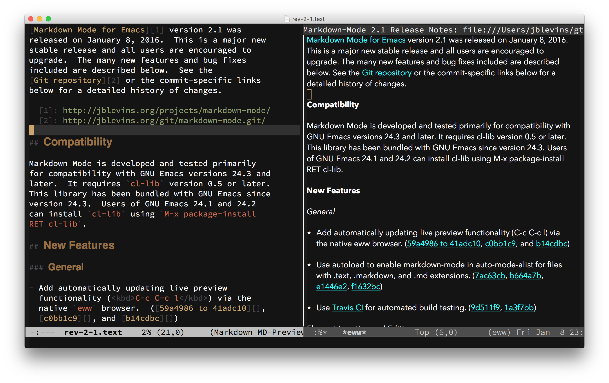

{mainmatter}

# Introduction {#intro}



This guide describes how to install, use, and customize [Markdown
Mode][mm], a major mode for editing Markdown-formatted text files
in [Emacs][em].  This guide is based on **Markdown Mode version 2.3**.

Markdown Mode and this guide were written by [Jason Blevins][jb].
Markdown Mode is free software, licensed under the [GNU General
Public License (GPL), version 2][gp], and it may be freely obtained
from the [Markdown Mode homepage][mm].

Funds from [sales of this book][bk] help support development of both
Markdown Mode and this Guide.  If you're reading this, then you're
likely one of the many people who rely on Markdown Mode to get your
work done.  If you haven't already, please consider supporting the
project by [buying the complete Guide][bk].

## Quick Reference

If you are a seasoned Markdown Mode user, here is a quick reference table:

| Action                                              | Keybinding        |
|-----------------------------------------------------|-------------------|
| **Headings**                                        |                   |
| Insert heading depending on context                 | `C-c C-s h`       |
| Insert heading, prefer Setext                       | `C-c C-s H`       |
| Insert atx heading of level # = 1, 2, … 6           | `C-c C-s #`       |
| Insert Setext heading of level 1                    | `C-c C-s !`       |
| Insert Setext heading of level 2                    | `C-c C-s @`       |
| **Inline Elements**                                 |                   |
| Bold                                                | `C-c C-s b`       |
| Italics                                             | `C-c C-s i`       |
| Inline code                                         | `C-c C-s c`       |
| `<kbd>` tag                                         | `C-c C-s k`       |
| Wiki link                                           | `C-c C-s w`       |
| **Block Elements**                                  |                   |
| Preformatted/code block (active region)             | `C-c C-s p`       |
| Preformatted/code block (region)                    | `C-c C-s P`       |
| Blockquote (active region)                          | `C-c C-s q`       |
| Blockquote (region)                                 | `C-c C-s Q`       |
| GFM code block                                      | `C-c C-s C`       |
| Edit code block in indirect buffer                  | `C-c '`           |
| **Links and Images**                                |                   |
| Insert or edit link (inline, reference, or URL)     | `C-c C-l`         |
| Insert or edit image (inline or reference)          | `C-c C-i`         |
| Follow link at point                                | `C-c C-o`         |
| Jump between reference link and definition          | `C-c C-d`         |
| Move to next link                                   | `M-n`             |
| Move to previous link                               | `M-p`             |
| **Footnotes**                                       |                   |
| Insert footnote                                     | `C-c C-s f`       |
| Jump between footnote and definition                | `C-c C-d`         |
| **List Items & List Editing**                       |                   |
| Insert new list item (same level)                   | `M-RET`           |
| Insert new list item (same level)                   | `C-c C-j`         |
| Insert new list item (parent level)                 | `C-u C-c C-j`     |
| Insert new list item (child level)                  | `C-u C-u C-c C-j` |
| Move list item up                                   | `C-c <up>`        |
| Move list item down                                 | `C-c <down>`      |
| Outdent/promote list item                           | `C-c <left>`      |
| Indent/demote list item                             | `C-c <right>`     |
| Toggle GFM checkbox                                 | `C-c C-x C-x`     |
| **Horizontal Rules**                                |                   |
| Insert default horizontal rule string               | `C-c C-s -`       |
| **Killing and Yanking**                             |                   |
| Kill element and keep text in kill ring             | `C-c C-k`         |
| Yank text back into buffer                          | `C-y`             |
| **Movement by Paragraph**                           |                   |
| Backward paragraph                                  | `M-{`             |
| Forward paragraph                                   | `M-}`             |
| Mark paragraph                                      | `M-h`             |
| **Movement by Block**                               |                   |
| Backward block                                      | `C-M-{`           |
| Forward block                                       | `C-M-}`           |
| Mark paragraph                                      | `C-c M-h`         |
| Narrow to block                                     | `C-x n b`         |
| Widen                                               | `C-x n w`         |
| **Movement by Section (Defun)**                     |                   |
| Beginning of current section                        | `C-M-a`           |
| End of current section                              | `C-M-e`           |
| Mark current section                                | `C-M-h`           |
| Narrow to current section                           | `C-x n d`         |
| Narrow to current subtree                           | `C-x n s`         |
| Widen                                               | `C-x n w`         |
| **Outline/List Movement**                           |                   |
| Next heading/list item (any level)                  | `C-c C-n`         |
| Previous heading/list item (any level)              | `C-c C-p`         |
| Next heading/list item at same level                | `C-c C-f`         |
| Previous heading/list item at same level            | `C-c C-b`         |
| Move up to parent heading/list item                 | `C-c C-u`         |
| **Outline Visibility Cycling**                      |                   |
| Cycle visibility: top-level only, all headings, all | `S-TAB`           |
| Cycle visibility of heading at point                | `TAB`             |
| **Outline Subtree Editing**                         |                   |
| Move subtree up                                     | `C-c <up>`        |
| Move subtree down                                   | `C-c <down>`      |
| Promote subtree                                     | `C-c <left>`      |
| Demote subtree                                      | `C-c <right>`     |
| **Region Editing**                                  |                   |
| Indent region                                       | `C-c >`           |
| Exdent region                                       | `C-c <`           |
| **Promotion and Demotion**                          |                   |
| Promote element (heading, list item, etc.) at point | `C-c -`           |
| Demote element (heading, list item, etc.) at point  | `C-c =`           |
| **Markup Completion**                               |                   |
| Complete markup at point or in region               | `C-c C-]`         |
| Complete markup in buffer                           | `C-c C-c ]`       |
| **Markdown & Utility Commands**                     |                   |
| Run Markdown, output to temporary buffer            | `C-c C-c m`       |
| Run Markdown, export to file                        | `C-c C-c e`       |
| Run Markdown and preview                            | `C-c C-c p`       |
| Run Markdown, export, and preview                   | `C-c C-c v`       |
| Run Markdown and save to kill ring                  | `C-c C-c w`       |
| Toggle live preview mode                            | `C-c C-c l`       |
| Open external previewer                             | `C-c C-c o`       |
| Check references in buffer                          | `C-c C-c c`       |
| Renumber ordered lists in buffer                    | `C-c C-c n`       |
| **Toggles and Settings**                            |                   |
| Toggle markup hiding                                | `C-c C-x C-m`     |
| Toggle URL hiding                                   | `C-c C-x C-l`     |
| Toggle native code block font lock                  | `C-c C-x C-f`     |
| Toggle inline images                                | `C-c C-x C-i`     |
| Toggle LaTeX math support                           | `C-c C-x C-e`     |
| Toggle GFM checkbox                                 | `C-c C-x C-x`     |

## Markdown

[Markdown][md] is a lightweight markup language, originally created
by [John Gruber][df] in 2004.  Markdown aims to be simultaneously easy
to write and easy to read.  It takes many cues from previous, similar
attempts (e.g., [atx][at] and [Setext][st]) as well as from existing
conventions for marking up plain text email.

“Markdown” is also used to refer to the original Markdown processor,
also written by Gruber, which is a Perl script that converts plain
Markdown-formatted text input to XHTML output.  It is distributed
under a BSD-style license and is included with, or available as a
plugin for, several content management systems.  In the remainder I
will refer to the processor by its filename, Markdown.pl, to
distinguish the two.  After the original Perl implementation, Markdown
processors have been implemented by others in a variety of programming
languages.

### Markdown Syntax Reference

For reference, below is a plain-text summary of Markdown's syntax.
Additional details about each type of element are explained in the
course of describing the available Markdown Mode commands.  See the
original [Markdown syntax page][sx] for more complete details.

``` markdown
# First-Level Header

## Second-Level Header

### Third-Level header

Paragraphs are separated by a blank line.

Text styles: _italic_, *italic*, __bold__, **bold**, `code`.

Horizontal rules:

---
***

Unordered list:

  * Item
  * Item
  * Item

Ordered list:

  1. apples
  2. oranges
  3. pears

Inline [link](http://jblevins.org/).

Reference [link][tag].

[tag]: http://jblevins.org/

Implicit reference [link][].

[link]: http://jblevins.org/projects/markdown-mode/

Use two spaces at the end of a line  
to create a hard line break.
```

Characters can be backslash-escaped in Markdown.  That is, characters
which are ordinarily interpreted by Markdown as formatting commands
will instead be interpreted literally if preceded by a backslash.  For
example, when you need to type a literal asterisk or underscore:

``` markdown
This is *italic*, but this \*is not\*.
```

Markdown.pl also does not transform any text within “raw” block-level
XHTML elements (although some other processors do).  Thus it is
possible to include sections of XHTML within a Markdown source
document by wrapping them in block-level XHTML tags.  However, with a
small number of exceptions (e.g., comments and `<kbd>` tags) Markdown
Mode does not explicitly support inline XHTML.

### Additional Information

For additional information on Markdown syntax, you can refer to the
following links:

*   [Markdown Syntax][sx] - the original syntax description by John Gruber
*   [Markdown Dingus](http://daringfireball.net/projects/markdown/dingus) - an online converter by John Gruber using the
    original Markdown.pl
*   [Wikipedia article](http://en.wikipedia.org/wiki/Markdown) - includes several examples of syntax as well as
    some background information on Markdown
*   [Mastering Markdown](https://guides.github.com/features/mastering-markdown/) - a guide to Markdown and GFM by GitHub
*   [Pandoc User's Guide](http://pandoc.org/MANUAL.html) - covers basic Markdown syntax as well as
    extensions supported by Pandoc
*   [PHP Markdown Reference](https://michelf.ca/projects/php-markdown/reference/) - covers basic Markdown syntax and PHP
    Markdown Extra extensions
*   [Write better Markdown](http://brettterpstra.com/2015/08/24/write-better-markdown/) - a style guide by Brett Terpstra

## History

<!-- FIXME: Update version number and release date. -->

As of this writing, the latest stable version is Markdown Mode version
2.3, released on **[RELEASE DATE]**.  See the [release notes][v2.3] for
details.  A complete listing of release notes can also be found
in [the appendix](#release-notes).

Markdown Mode was originally written and is still maintained
by [Jason Blevins][jb].  The initial release, version 1.1, was created on
May 24, 2007.

Historically, version numbering began at 1.1 because the source code
was originally stored in RCS (Revision Control System), which numbers
revisions starting at 1.1 by default.  After version 1.5, the source
was moved to Git, where it still resides today.  See the chapter
on [Markdown Mode Development](#devel) for instructions to obtain the source
code.

  * 2007-05-24: [Version 1.1][v1.1]
  * 2007-05-25: [Version 1.2][v1.2]
  * 2007-06-05: [Version 1.3][v1.3]
  * 2007-06-29: [Version 1.4][v1.4]
  * 2007-10-11: [Version 1.5][v1.5]
  * 2008-06-04: [Version 1.6][v1.6]
  * 2009-10-01: [Version 1.7][v1.7]
  * 2011-08-12: [Version 1.8][v1.8]
  * 2011-08-15: [Version 1.8.1][v1.8.1]
  * 2013-01-25: [Version 1.9][v1.9]
  * 2013-03-24: [Version 2.0][v2.0]
  * 2016-01-09: [Version 2.1][v2.1]
  * 2017-05-26: [Version 2.2][v2.2]

## Acknowledgments

Markdown Mode has benefited greatly from the efforts of the many
volunteers who have sent patches, test cases, bug reports,
suggestions, helped with packaging, etc.  Thank you for your
contributions!  Markdown Mode is much more robust and includes many
additional features as a result of your efforts.  Below is a partial
list of contributors (in alphabetical order) who sent substantial
patches, test cases, bug reports, suggestions, helped with packaging,
etc.  See the [GitHub contributors graph][cg] and the commit log for more
details.

<!--
git shortlog -s -n | awk '{ $1=""; print $0 }'
M-x sort-regexp-fields RET \(.*\) \(.*?\)$ RET 2 RET
-->

> Masayuki Ataka, Hilko Bengen, Jonas Bernoulli, Greg Bognar, Roger
> Bolsius, Daniel Brotsky, Cyril Brulebois, Daniel Burrows, Donald
> Ephraim Curtis, Julien Danjou, Werner Dittmann, Jeremiah Dodds,
> Carsten Dominik, Michael Dwyer, Dmitry Dzhus, Peter Eisentraut,
> Conal Elliott, Bryan Fink, Gunnar Franke, Samuel Freilich, Shigeru
> Fukaya, Peter S. Galbraith, Francois Gannaz, David Glasser, Matus
> Goljer, Kévin Le Gouguec, Marijn Haverbeke, Isaac Hodes, Philippe
> Ivaldi, Zhenlei Jia, Peter Jones, Antonis Kanouras, Marcin
> Kasperski, Keshav Kini, Dave Kleinschmidt, Vasily Korytov, Joost
> Kremers, Bryan Kyle, Kévin Le Gouguec, Chris Lott, Christopher
> J. Madsen, Tom May, Danny McClanahan, Matt McClure, Howard Melman,
> Eric Merritt, Nelson Minar, Stefan Monnier, Makoto Motohashi, Jon
> Mountjoy, Akinori Musha, Pierre Neidhardt, Spanti Nicola, Theresa
> O'Connor, George Ogata, Paul W. Rankin, Jose A. Ortega Ruiz, Max
> Penet, Nicolas Petton, Jorge Israel Peña, Scott Pfister, Kevin
> Porter, Steve Purcell, Alec Resnick, Christophe Rhodes, Dale
> Sedivec, Ankit Solanki, Tyler Smith, Michael Sperber, Mike Sperber,
> Vitalie Spinu, Philipp Stephani, Moogen Tian, Vegard Vesterheim, Tim
> Visher, Ben Voui, Sebastian Wiesner, Peter Williams, Tianxiang
> Xiong, Ian Yang, Syohei Yoshida, and Google, Inc.

# Installation {#install}

There are many ways to load packages in Emacs, but here I will cover
three: installation using the built-in Emacs package manager
(recommended), manual installation, and installation using a
system-wide package manager.

Markdown Mode is compatible with Emacs 24.3 and later, and it has few
dependencies.  To enable editing of code blocks in indirect buffers
using `C-c '`, you will need to install the [edit-indirect][ei]
package.

*Note:* This chapter covers installing the stable version of Markdown
Mode, but installing the development version is similar.  If you'd
like to test the development version see the [Development](#devel)
chapter at the end.

## Emacs Package Manager

The recommended way to install Markdown Mode is to use the built-in
Emacs package manager, `package.el`, which has been included since
Emacs 23.  Markdown Mode can be installed via the `markdown-mode`
package in the [MELPA Stable repository][ms].[^MELPA]

First, you'll need to configure the package manager to use the MELPA
Stable repository by adding the following to your `.emacs`, `init.el`,
or equivalent init file:

``` emacs-lisp
(require 'package)
(add-to-list 'package-archives
    '("melpa-stable" . "https://stable.melpa.org/packages/"))
(package-initialize)
```

Then, after restarting Emacs or evaluating the above statements, issue
the following command: `M-x package-install RET markdown-mode RET`.
When installed this way, the major modes `markdown-mode` and
`gfm-mode` will be autoloaded and `markdown-mode` will be invoked
automatically for file names ending in either `.md` or `.markdown`.

Alternatively, if you manage loading packages with [use-package][up]
(a practice I highly recommend for advanced users) then you can
automatically install and configure `markdown-mode` by adding a
declaration such as this one to your init file (as an example; adjust
settings as desired):

``` emacs-lisp
(use-package markdown-mode
  :ensure t
  :commands (markdown-mode gfm-mode)
  :mode (("README\\.md\\'" . gfm-mode)
         ("\\.md\\'" . markdown-mode)
         ("\\.markdown\\'" . markdown-mode))
  :init (setq markdown-command "multimarkdown"))
```

Finally, if you prefer to install and use the development version of
Markdown Mode, which may be unstable or possibly even unusable at
times, you can install the `markdown-mode` package from the
(unstable) [MELPA repository][ml] instead.  In this case, you might
need to tell the package manager about the repository in your init
file, like so:

``` emacs-lisp
(require 'package)
(add-to-list 'package-archives
    '("melpa" . "http://melpa.org/packages/"))
(package-initialize)
```

## OS Package Manager

Markdown Mode is also available in various package managers on several
operating systems.  You should confirm that the package you install
contains the latest stable version (and please notify the package
maintainer if not).  These packages also typically do not byte compile
the source files or configure them to load automatically, so you may
still need to follow the manual installation instructions in the
following section.

**MacOS:** MacOS users who use Homebrew can install
the [homebrew/emacs/markdown-mode][hb] formula, which in turn
obtains the latest stable version of Markdown Mode from GitHub.

``` shell
brew update
brew install dunn/emacs/markdown-mode
```

This will install files in
`/usr/local/share/emacs/site-lisp/markdown-mode`.  Depending on where
you obtained Emacs, this directory may or may not be in your
`load-path`, so you may need to add it as described below for manual
installation.

If you are a MacPorts user, there does not seem to be an up to date
port.  The existing [markdown-mode.el][mp] port currently points to a
Git revision from 2014.  There is also a [pending][mt] ticket for a
new port, but there has been no activity.  Rather than installing from
MacPorts, I recommend using the Emacs package manager as described
above.

**Debian and Ubuntu Linux:** On Debian-based distributions, Markdown
Mode can be installed via the [elpa-markdown-mode][dp] package.

``` shell
sudo apt-get update
sudo apt-get install elpa-markdown-mode
```

**FreeBSD:** FreeBSD users can install
the [textproc/markdown-mode.el][fb] port, but note that the
installed files are not byte compiled.  Users who install this port
will also need to edit their init files following the Manual
installation instructions below, to load Markdown Mode.

**NetBSD:** Markdown Mode is available in pkgsrc
as [textproc/markdown-mode][nb], but (as of May 8 2017) it installs and
byte-compiles an outdated version of Markdown Mode.  If you use this
package, you'll also need to edit your init file following the Manual
installation instructions below, to load Markdown Mode.  Rather than
installing this package, use the Emacs package manager as described
above.

``` shell
pkg_add textproc/markdown-mode
```

## Manual Download

Alternatively you can manually download and install Markdown Mode.
First, download the [latest stable version][el] and save
the file where Emacs can find it (i.e., a directory in your
`load-path`).  You can then configure `markdown-mode` and `gfm-mode`
to load automatically by adding the following to your init file:

``` emacs-lisp
(autoload 'markdown-mode "markdown-mode"
   "Major mode for editing Markdown files" t)
(add-to-list 'auto-mode-alist
    '("\\.markdown\\'" . markdown-mode))
(add-to-list 'auto-mode-alist
    '("\\.md\\'" . markdown-mode))

(autoload 'gfm-mode "markdown-mode"
   "Major mode for GitHub Flavored Markdown files" t)
(add-to-list 'auto-mode-alist
    '("README\\.md\\'" . gfm-mode))
```

------------------------------------------------------------------------------

# Markdown Mode Development {#devel}

Markdown Mode is an open source project.  The primary repository for
Markdown Mode is [on GitHub][gh].  Anyone can easily browse the
project files by visiting the project's GitHub page
at <https://github.com/jrblevin/markdown-mode>.

If you would like to contribute to Markdown Mode development, the best
way to start is to clone the Git repository.  You can clone the
repository using several protocols:

* HTTPS: `git clone https://github.com/jrblevin/markdown-mode.git`
* Git: `git clone git://github.com/jrblevin/markdown-mode.git`
* SSH: `git clone ssh://git@github.com:jrblevin/markdown-mode.git`

## Testing the Development Version

To test the current development version, you may either download
`markdown-mode.el` from the [GitHub repository][gh] or install the
`markdown-mode` package from [MELPA][ml].

Note that by nature, the development version of Markdown Mode may be
unstable or even unusable at times.  I do not recommend it for daily
use unless you are fine with things occasionally breaking.  Function
names, features, keybindings, etc. may change without notice.

Supposing you have stored `markdown-mode.el` in directory named
`/path/to/markdown-mode/`, then you'll probably need to make sure that
Emacs can find it by adding something like the following to your init
file:

``` emacs-lisp
(add-to-list 'load-path "/path/to/markdown-mode/")
```

## Reporting Bugs and Issues

Markdown Mode is developed and tested primarily for compatibility with
GNU Emacs 24.3 and later.  If you are using an older version of Emacs,
please update to a more recent version first to see if the issue
persists.

If you do find a bug in Markdown Mode, please construct a test
case—and if possible a patch—and open a ticket on the
[GitHub issue tracker][is].

------------------------------------------------------------------------------

{backmatter}

  [^MELPA]: MELPA is Milkypostman's Emacs Lisp Package Archive at <http://melpa.org/>.

  [at]: http://www.aaronsw.com/2002/atx/
  [bk]: https://leanpub.com/markdown-mode
  [cg]: https://github.com/jrblevin/markdown-mode/graphs/contributors
  [df]: https://daringfireball.net
  [dp]: https://packages.debian.org/sid/lisp/elpa-markdown-mode
  [du]: http://packages.ubuntu.com/search?keywords=elpa-markdown-mode
  [ei]: https://github.com/Fanael/edit-indirect/
  [el]: http://jblevins.org/projects/markdown-mode/markdown-mode.el
  [em]: https://www.gnu.org/software/emacs/
  [fb]: http://svnweb.freebsd.org/ports/head/textproc/markdown-mode.el
  [gh]: https://github.com/jrblevin/markdown-mode
  [gp]: https://www.gnu.org/licenses/old-licenses/gpl-2.0.html
  [hb]: https://github.com/dunn/homebrew-emacs/blob/master/Formula/markdown-mode.rb
  [is]: https://github.com/jrblevin/markdown-mode/issues
  [jb]: http://jblevins.org/
  [md]: http://daringfireball.net/projects/markdown/
  [ml]: https://melpa.org/#/markdown-mode
  [mm]: http://jblevins.org/projects/markdown-mode/
  [mp]: https://trac.macports.org/browser/trunk/dports/editors/markdown-mode.el/Portfile
  [ms]: https://stable.melpa.org/#/markdown-mode
  [mt]: http://trac.macports.org/ticket/35716
  [nb]: http://pkgsrc.se/textproc/markdown-mode
  [st]: http://docutils.sourceforge.net/mirror/setext.html 
  [sx]: http://daringfireball.net/projects/markdown/syntax
  [up]: https://github.com/jwiegley/use-package
  [v1.1]: http://jblevins.org/projects/markdown-mode/rev-1-1
  [v1.2]: http://jblevins.org/projects/markdown-mode/rev-1-2
  [v1.3]: http://jblevins.org/projects/markdown-mode/rev-1-3
  [v1.4]: http://jblevins.org/projects/markdown-mode/rev-1-4
  [v1.5]: http://jblevins.org/projects/markdown-mode/rev-1-5
  [v1.6]: http://jblevins.org/projects/markdown-mode/rev-1-6
  [v1.7]: http://jblevins.org/projects/markdown-mode/rev-1-7
  [v1.8.1]: http://jblevins.org/projects/markdown-mode/rev-1-8-1
  [v1.8]: http://jblevins.org/projects/markdown-mode/rev-1-8
  [v1.9]: http://jblevins.org/projects/markdown-mode/rev-1-9
  [v2.0]: http://jblevins.org/projects/markdown-mode/rev-2-0
  [v2.1]: http://jblevins.org/projects/markdown-mode/rev-2-1
  [v2.2]: http://jblevins.org/projects/markdown-mode/rev-2-2
  [v2.3]: http://jblevins.org/projects/markdown-mode/rev-2-3
