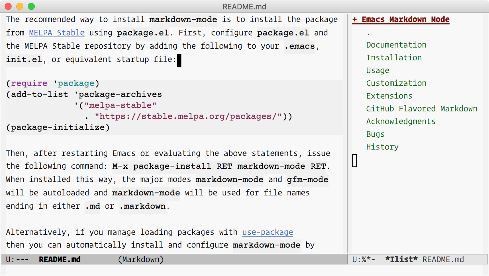
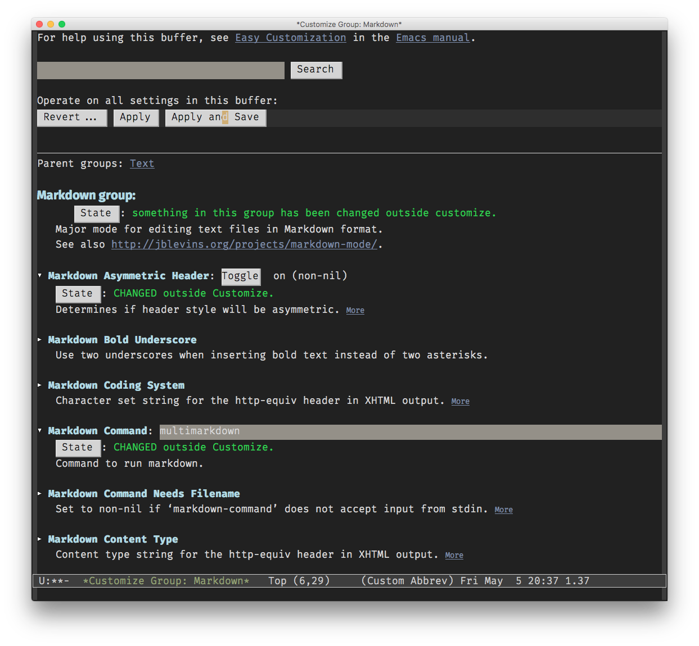
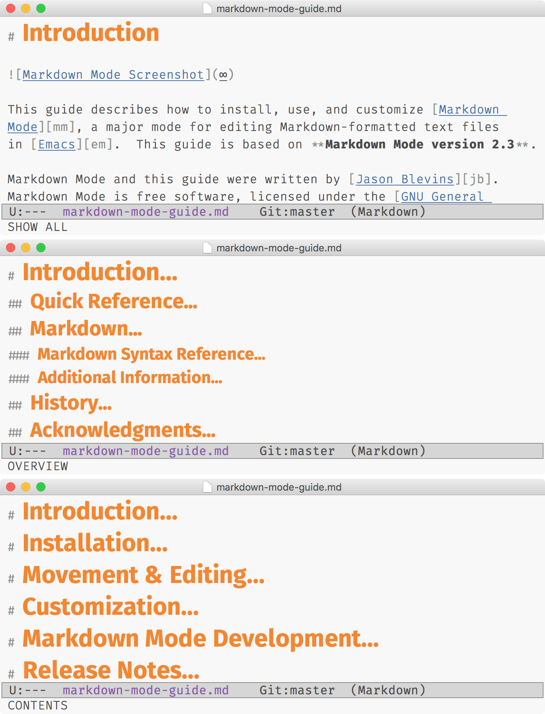
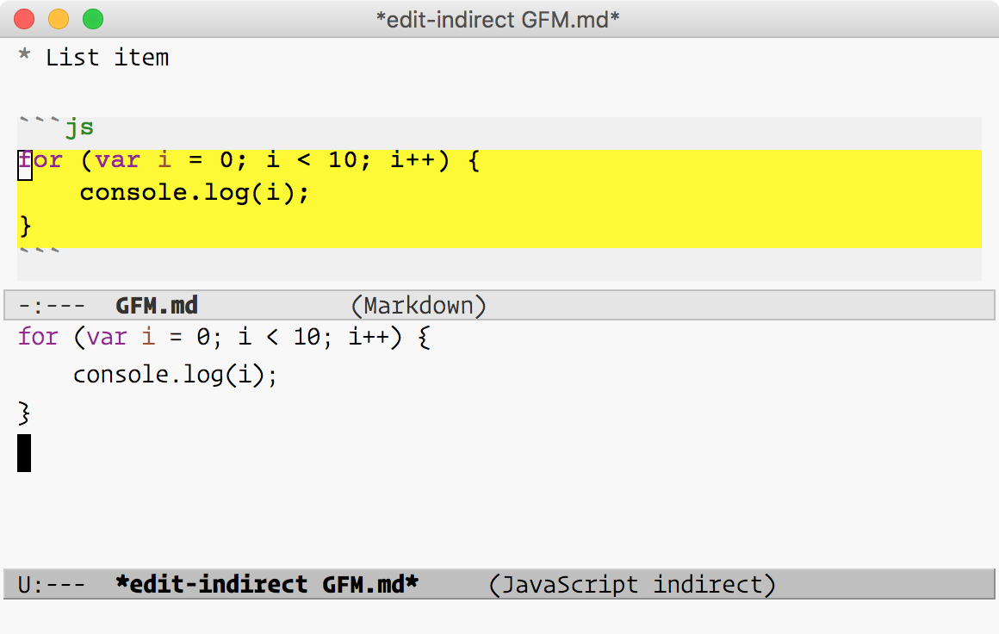
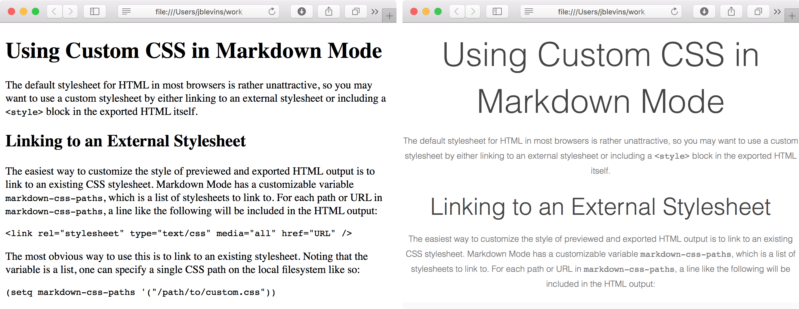
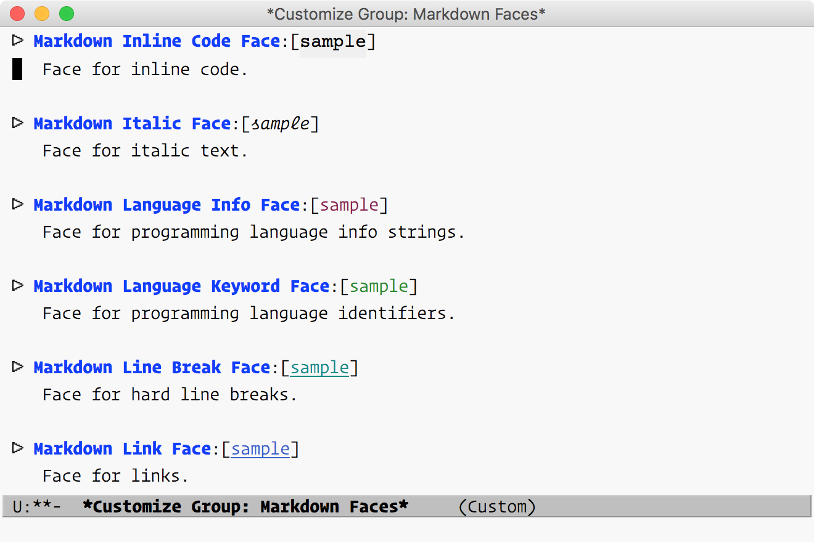
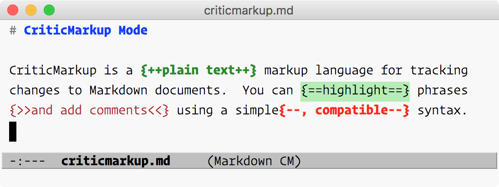

{mainmatter}

# Introduction {#intro}



This guide describes how to install, use, and customize [Markdown
Mode][mm], a major mode for editing Markdown-formatted text files
in [Emacs][em].  This guide is based on **Markdown Mode version 2.3**.

Markdown Mode and this guide were written by [Jason Blevins][jb].
Markdown Mode is free software, licensed under the [GNU General
Public License (GPL), version 2][gp], and it may be freely obtained
from the [Markdown Mode homepage][mm].

Funds from [sales of this book][bk] help support development of both
Markdown Mode and this Guide.  If you're reading this, then you're
likely one of the many people who rely on Markdown Mode to get your
work done.  If you haven't already, please consider supporting the
project by [buying the complete Guide][bk].

## Quick Reference

If you are a seasoned Markdown Mode user, here is a quick reference table:

| Action                                              | Keybinding        |
|-----------------------------------------------------|-------------------|
| **Headings**                                        |                   |
| Insert heading depending on context                 | `C-c C-s h`       |
| Insert heading, prefer Setext                       | `C-c C-s H`       |
| Insert atx heading of level # = 1, 2, … 6           | `C-c C-s #`       |
| Insert Setext heading of level 1                    | `C-c C-s !`       |
| Insert Setext heading of level 2                    | `C-c C-s @`       |
| **Inline Elements**                                 |                   |
| Bold                                                | `C-c C-s b`       |
| Italics                                             | `C-c C-s i`       |
| Inline code                                         | `C-c C-s c`       |
| `kbd` tag                                           | `C-c C-s k`       |
| Wiki link                                           | `C-c C-s w`       |
| **Block Elements**                                  |                   |
| Preformatted/code block                             | `C-c C-s p`       |
| Preformatted/code block (region)                    | `C-c C-s P`       |
| Blockquote                                          | `C-c C-s q`       |
| Blockquote (region)                                 | `C-c C-s Q`       |
| GFM code block                                      | `C-c C-s C`       |
| Edit code block in indirect buffer                  | `C-c '`           |
| **Links and Images**                                |                   |
| Insert or edit link (inline, reference, or URL)     | `C-c C-l`         |
| Insert or edit image (inline or reference)          | `C-c C-i`         |
| Follow link at point                                | `C-c C-o`         |
| Jump between reference link and definition          | `C-c C-d`         |
| Move to next link                                   | `M-n`             |
| Move to previous link                               | `M-p`             |
| **Footnotes**                                       |                   |
| Insert footnote                                     | `C-c C-s f`       |
| Jump between footnote and definition                | `C-c C-d`         |
| **List Items & List Editing**                       |                   |
| Insert new list item (same level)                   | `M-RET`           |
| Insert new list item (same level)                   | `C-c C-j`         |
| Insert new list item (parent level)                 | `C-u C-c C-j`     |
| Insert new list item (child level)                  | `C-u C-u C-c C-j` |
| Move list item up                                   | `C-c <up>`        |
| Move list item down                                 | `C-c <down>`      |
| Outdent/promote list item                           | `C-c <left>`      |
| Indent/demote list item                             | `C-c <right>`     |
| Toggle GFM checkbox                                 | `C-c C-x C-x`     |
| **Horizontal Rules**                                |                   |
| Insert default horizontal rule string               | `C-c C-s -`       |
| **Killing and Yanking**                             |                   |
| Kill element and keep text in kill ring             | `C-c C-k`         |
| Yank text back into buffer                          | `C-y`             |
| **Movement by Paragraph**                           |                   |
| Backward paragraph                                  | `M-{`             |
| Forward paragraph                                   | `M-}`             |
| Mark paragraph                                      | `M-h`             |
| **Movement by Block**                               |                   |
| Backward block                                      | `C-M-{`           |
| Forward block                                       | `C-M-}`           |
| Mark paragraph                                      | `C-c M-h`         |
| Narrow to block                                     | `C-x n b`         |
| Widen                                               | `C-x n w`         |
| **Movement by Section (Defun)**                     |                   |
| Beginning of current section                        | `C-M-a`           |
| End of current section                              | `C-M-e`           |
| Mark current section                                | `C-M-h`           |
| Narrow to current section                           | `C-x n d`         |
| Narrow to current subtree                           | `C-x n s`         |
| Widen                                               | `C-x n w`         |
| **Outline/List Movement**                           |                   |
| Next heading/list item (any level)                  | `C-c C-n`         |
| Previous heading/list item (any level)              | `C-c C-p`         |
| Next heading/list item at same level                | `C-c C-f`         |
| Previous heading/list item at same level            | `C-c C-b`         |
| Move up to parent heading/list item                 | `C-c C-u`         |
| **Outline Visibility Cycling**                      |                   |
| Cycle visibility: top-level only, all headings, all | `S-TAB`           |
| Cycle visibility of heading at point                | `TAB`             |
| **Outline Subtree Editing**                         |                   |
| Move subtree up                                     | `C-c <up>`        |
| Move subtree down                                   | `C-c <down>`      |
| Promote subtree                                     | `C-c <left>`      |
| Demote subtree                                      | `C-c <right>`     |
| **Region Editing**                                  |                   |
| Indent region                                       | `C-c >`           |
| Exdent region                                       | `C-c <`           |
| **Promotion and Demotion**                          |                   |
| Promote element (heading, list item, etc.) at point | `C-c -`           |
| Demote element (heading, list item, etc.) at point  | `C-c =`           |
| **Markup Completion**                               |                   |
| Complete markup at point or in region               | `C-c C-]`         |
| Complete markup in buffer                           | `C-c C-c ]`       |
| **Markdown & Utility Commands**                     |                   |
| Run Markdown, output to temporary buffer            | `C-c C-c m`       |
| Run Markdown, export to file                        | `C-c C-c e`       |
| Run Markdown and preview                            | `C-c C-c p`       |
| Run Markdown, export, and preview                   | `C-c C-c v`       |
| Run Markdown and save to kill ring                  | `C-c C-c w`       |
| Toggle live preview mode                            | `C-c C-c l`       |
| Open external previewer                             | `C-c C-c o`       |
| Check references in buffer                          | `C-c C-c c`       |
| Renumber ordered lists in buffer                    | `C-c C-c n`       |
| **Toggles and Settings**                            |                   |
| Toggle markup hiding                                | `C-c C-x C-m`     |
| Toggle URL hiding                                   | `C-c C-x C-l`     |
| Toggle native code block font lock                  | `C-c C-x C-f`     |
| Toggle inline images                                | `C-c C-x C-i`     |
| Toggle LaTeX math support                           | `C-c C-x C-e`     |
| Toggle GFM checkbox                                 | `C-c C-x C-x`     |

## Markdown

[Markdown][md] is a lightweight markup language, originally created
by [John Gruber][df] in 2004.  Markdown aims to be simultaneously easy
to write and easy to read.  It takes many cues from previous, similar
attempts (e.g., [atx][at] and [Setext][st]) as well as from existing
conventions for marking up plain text email.

“Markdown” is also used to refer to the original Markdown processor,
also written by Gruber, which is a Perl script that converts plain
Markdown-formatted text input to XHTML output.  It is distributed
under a BSD-style license and is included with, or available as a
plugin for, several content management systems.  In the remainder I
will refer to the processor by its filename, Markdown.pl, to
distinguish the two.  After the original Perl implementation, Markdown
processors have been implemented by others in a variety of programming
languages.

### Markdown Syntax Reference

For reference, below is a plain-text summary of Markdown's syntax.
Additional details about each type of element are explained in the
course of describing the available Markdown Mode commands.  See the
original [Markdown syntax page][sx] for more complete details.

```
# First-Level Header

## Second-Level Header

### Third-Level header

Paragraphs are separated by a blank line.

Text styles: _italic_, *italic*, __bold__, **bold**, `code`.

Horizontal rules:

---
***

Unordered list:

  * Item
  * Item
  * Item

Ordered list:

  1. apples
  2. oranges
  3. pears

Inline [link](https://jblevins.org/).

Reference [link][tag].

[tag]: https://jblevins.org/

Implicit reference [link][].

[link]: https://jblevins.org/projects/markdown-mode/

Use two spaces at the end of a line  
to create a hard line break.
```

Characters can be backslash-escaped in Markdown.  That is, characters
which are ordinarily interpreted by Markdown as formatting commands
will instead be interpreted literally if preceded by a backslash.  For
example, when you need to type a literal asterisk or underscore:

```
This is *italic*, but this \*is not\*.
```

Markdown.pl also does not transform any text within “raw” block-level
XHTML elements (although some other processors do).  Thus it is
possible to include sections of XHTML within a Markdown source
document by wrapping them in block-level XHTML tags.  However, with a
small number of exceptions (e.g., comments and `kbd` tags) Markdown
Mode does not explicitly support inline XHTML.

### Additional Information

For additional information on Markdown syntax, you can refer to the
following links:

*   [Markdown Syntax][sx] - the original syntax description by John Gruber
*   [Markdown Dingus](http://daringfireball.net/projects/markdown/dingus) - an online converter by John Gruber using the
    original Markdown.pl
*   [Wikipedia article](http://en.wikipedia.org/wiki/Markdown) - includes several examples of syntax as well as
    some background information on Markdown
*   [Mastering Markdown](https://guides.github.com/features/mastering-markdown/) - a guide to Markdown and GFM by GitHub
*   [Pandoc User's Guide](http://pandoc.org/MANUAL.html) - covers basic Markdown syntax as well as
    extensions supported by Pandoc
*   [PHP Markdown Reference](https://michelf.ca/projects/php-markdown/reference/) - covers basic Markdown syntax and PHP
    Markdown Extra extensions
*   [Write better Markdown](http://brettterpstra.com/2015/08/24/write-better-markdown/) - a style guide by Brett Terpstra

## History

<!-- FIXME: Update version number and release date. -->

As of this writing, the latest stable version is Markdown Mode version
2.3, released on **[RELEASE DATE]**.  See the [release notes][v2.3] for
details.  A complete listing of release notes can also be found
in [the appendix](#release-notes).

Markdown Mode was originally written and is still maintained
by [Jason Blevins][jb].  The initial release, version 1.1, was created on
May 24, 2007.

Historically, version numbering began at 1.1 because the source code
was originally stored in RCS (Revision Control System), which numbers
revisions starting at 1.1 by default.  After version 1.5, the source
was moved to Git, where it still resides today.  See the chapter
on [Markdown Mode Development](#devel) for instructions to obtain the source
code.

  * 2007-05-24: [Version 1.1][v1.1]
  * 2007-05-25: [Version 1.2][v1.2]
  * 2007-06-05: [Version 1.3][v1.3]
  * 2007-06-29: [Version 1.4][v1.4]
  * 2007-10-11: [Version 1.5][v1.5]
  * 2008-06-04: [Version 1.6][v1.6]
  * 2009-10-01: [Version 1.7][v1.7]
  * 2011-08-12: [Version 1.8][v1.8]
  * 2011-08-15: [Version 1.8.1][v1.8.1]
  * 2013-01-25: [Version 1.9][v1.9]
  * 2013-03-24: [Version 2.0][v2.0]
  * 2016-01-09: [Version 2.1][v2.1]
  * 2017-05-26: [Version 2.2][v2.2]

## Acknowledgments

Markdown Mode has benefited greatly from the efforts of the many
volunteers who have sent patches, test cases, bug reports,
suggestions, helped with packaging, etc.  Thank you for your
contributions!  Markdown Mode is much more robust and includes many
additional features as a result of your efforts.  Below is a partial
list of contributors (in alphabetical order) who sent substantial
patches, test cases, bug reports, suggestions, helped with packaging,
etc.  See the [GitHub contributors graph][cg] and the commit log for more
details.

<!--
git shortlog -s -n | awk '{ $1=""; print $0 }'
M-x sort-regexp-fields RET \(.*\) \(.*?\)$ RET 2 RET
-->

> Masayuki Ataka, Hilko Bengen, Jonas Bernoulli, Greg Bognar, Roger
> Bolsius, Daniel Brotsky, Cyril Brulebois, Daniel Burrows, Donald
> Ephraim Curtis, Julien Danjou, Werner Dittmann, Jeremiah Dodds,
> Carsten Dominik, Michael Dwyer, Dmitry Dzhus, Peter Eisentraut,
> Conal Elliott, Bryan Fink, Gunnar Franke, Samuel Freilich, Shigeru
> Fukaya, Peter S. Galbraith, Francois Gannaz, David Glasser, Matus
> Goljer, Kévin Le Gouguec, Marijn Haverbeke, Isaac Hodes, Philippe
> Ivaldi, Zhenlei Jia, Peter Jones, Antonis Kanouras, Marcin
> Kasperski, Keshav Kini, Dave Kleinschmidt, Vasily Korytov, Joost
> Kremers, Bryan Kyle, Kévin Le Gouguec, Chris Lott, Christopher
> J. Madsen, Tom May, Danny McClanahan, Matt McClure, Howard Melman,
> Eric Merritt, Nelson Minar, Stefan Monnier, Makoto Motohashi, Jon
> Mountjoy, Akinori Musha, Pierre Neidhardt, Spanti Nicola, Theresa
> O'Connor, George Ogata, Paul W. Rankin, Jose A. Ortega Ruiz, Max
> Penet, Nicolas Petton, Jorge Israel Peña, Scott Pfister, Kevin
> Porter, Steve Purcell, Alec Resnick, Christophe Rhodes, Dale
> Sedivec, Ankit Solanki, Tyler Smith, Michael Sperber, Mike Sperber,
> Vitalie Spinu, Philipp Stephani, Moogen Tian, Vegard Vesterheim, Tim
> Visher, Ben Voui, Sebastian Wiesner, Peter Williams, Tianxiang
> Xiong, Ian Yang, Syohei Yoshida, and Google, Inc.

# Installation & Configuration {#install}

There are many ways to load packages in Emacs, but here I will cover
three: installation using the built-in Emacs package manager
(recommended), manual installation, and installation using a
system-wide package manager.

Markdown Mode is compatible with Emacs 24.3 and later, and it has few
dependencies.  To enable editing of code blocks in indirect buffers
using `C-c '`, you will need to install the [edit-indirect][ei]
package.

*Note:* This chapter covers installing the stable version of Markdown
Mode, but installing the development version is similar.  If you'd
like to test the development version see the [Development](#devel)
chapter at the end.

## Installation Methods

### Emacs Package Manager

The recommended way to install Markdown Mode is to use the built-in
Emacs package manager, `package.el`, which has been included since
Emacs 23.  Markdown Mode can be installed via the `markdown-mode`
package in the [MELPA Stable repository][ms].[^MELPA]

First, you'll need to configure the package manager to use the MELPA
Stable repository by adding the following to your `.emacs`, `init.el`,
or equivalent init file:

``` emacs-lisp
(require 'package)
(add-to-list 'package-archives
    '("melpa-stable" . "https://stable.melpa.org/packages/"))
(package-initialize)
```

Then, after restarting Emacs or evaluating the above statements, issue
the following command: `M-x package-install RET markdown-mode RET`.
When installed this way, the major modes `markdown-mode` and
`gfm-mode` will be autoloaded and `markdown-mode` will be invoked
automatically for file names ending in either `.md` or `.markdown`.

Alternatively, if you manage loading packages with [use-package][up]
(a practice I highly recommend for advanced users) then you can
automatically install and configure `markdown-mode` by adding a
declaration such as this one to your init file (as an example; adjust
settings as desired):

``` emacs-lisp
(use-package markdown-mode
  :ensure t
  :commands (markdown-mode gfm-mode)
  :mode (("README\\.md\\'" . gfm-mode)
         ("\\.md\\'" . markdown-mode)
         ("\\.markdown\\'" . markdown-mode))
  :init (setq markdown-command "multimarkdown"))
```

Finally, if you prefer to install and use the development version of
Markdown Mode, which may be unstable or possibly even unusable at
times, you can install the `markdown-mode` package from the
(unstable) [MELPA repository][ml] instead.  In this case, you might
need to tell the package manager about the repository in your init
file, like so:

``` emacs-lisp
(require 'package)
(add-to-list 'package-archives
    '("melpa" . "http://melpa.org/packages/"))
(package-initialize)
```

### OS Package Manager

Markdown Mode is also available in various package managers on several
operating systems.  You should confirm that the package you install
contains the latest stable version (and please notify the package
maintainer if not).  These packages also typically do not byte compile
the source files or configure them to load automatically, so you may
still need to follow the manual installation instructions in the
following section.

**MacOS:** MacOS users who use Homebrew can install
the [homebrew/emacs/markdown-mode][hb] formula, which in turn
obtains the latest stable version of Markdown Mode from GitHub.

``` shell
brew update
brew install dunn/emacs/markdown-mode
```

This will install files in
`/usr/local/share/emacs/site-lisp/markdown-mode`.  Depending on where
you obtained Emacs, this directory may or may not be in your
`load-path`, so you may need to add it as described below for manual
installation.

If you are a MacPorts user, there does not seem to be an up to date
port.  The existing [markdown-mode.el][mp] port currently points to a
Git revision from 2014.  There is also a [pending][mt] ticket for a
new port, but there has been no activity.  Rather than installing from
MacPorts, I recommend using the Emacs package manager as described
above.

**Debian and Ubuntu Linux:** On Debian-based distributions, Markdown
Mode can be installed via the [elpa-markdown-mode][dp] package.

``` shell
sudo apt-get update
sudo apt-get install elpa-markdown-mode
```

**FreeBSD:** FreeBSD users can install
the [textproc/markdown-mode.el][fb] port, but note that the
installed files are not byte compiled.  Users who install this port
will also need to edit their init files following the Manual
installation instructions below, to load Markdown Mode.

**NetBSD:** Markdown Mode is available in pkgsrc
as [textproc/markdown-mode][nb], but (as of May 8 2017) it installs and
byte-compiles an outdated version of Markdown Mode.  If you use this
package, you'll also need to edit your init file following the Manual
installation instructions below, to load Markdown Mode.  Rather than
installing this package, use the Emacs package manager as described
above.

``` shell
pkg_add textproc/markdown-mode
```

### Manual Download

Alternatively you can manually download and install Markdown Mode.
First, download the [latest stable version][el] and save
the file where Emacs can find it (i.e., a directory in your
`load-path`).  You can then configure `markdown-mode` and `gfm-mode`
to load automatically by adding the following to your init file:

``` emacs-lisp
(autoload 'markdown-mode "markdown-mode"
   "Major mode for editing Markdown files" t)
(add-to-list 'auto-mode-alist
    '("\\.markdown\\'" . markdown-mode))
(add-to-list 'auto-mode-alist
    '("\\.md\\'" . markdown-mode))

(autoload 'gfm-mode "markdown-mode"
   "Major mode for GitHub Flavored Markdown files" t)
(add-to-list 'auto-mode-alist
    '("README\\.md\\'" . gfm-mode))
```

## Configuration {#configuration}

Although strictly speaking no configuration is *necessary*, there are
a few settings that users should usually customize.  The most important
is the `markdown-command` variable, which tells Markdown Mode where to
find an external program for converting Markdown to HTML on your system.

When in Markdown Mode, the `M-x customize-mode` command provides an
interface to all of the possible customizations.  If you are currently
using a different mode, then you'll need to be more specific: `M-x
customize-mode RET markdown-mode`.  Alternatively, you can customize
variables using `M-x customize-group RET markdown` (i.e., by
customizing the *group* rather than the *mode*).



T> If you use this built-in customize interface, be sure to save your
T> changes before closing the buffer by clicking the "Apply and Save"
T> button.

### Markdown Command

The main variable you'll most likely need to customize is
`markdown-command`.  Markdown Mode expects that a Markdown binary is
available, determined by the value of `markdown-command`.  You should
customize this variable so that Markdown Mode uses your Markdown
processor of choice.

`markdown-command`

:   The `markdown-command` variable contains the command used to run
    Markdown.  The default is to look for an executable named
    `markdown` in the Emacs `exec-path`.

You can either provide the full path to the executable, or you can
simply provide the name if the executable is in your Emacs
`exec-path`.  See below for details on determining and configuring
your `exec-path`.

If you are using the customize interface, you simply need to type the
path to your Markdown script or binary in the "Markdown Command" field
in the customize interface (e.g., `/usr/local/bin/multimarkdown`).  If
you know the name of the executable, but you're not sure where it is
located, and you are using macOS or Linux, you can find it by typing
`which multimarkdown` at the command line.

To set this variable in your init file, add a line such as the
following:

``` emacs-lisp
(setq markdown-command "/usr/local/bin/multimarkdown")
```

#### Markdown Command and `exec-path`

You can always set `markdown-command` to be the full path to the
executable, but a better solution is to set your `exec-path` properly.
A simple way to do this is to use the `exec-path-from-shell` package,
which sets the Emacs `exec-path` using your system `$PATH` variable,
allowing Emacs to find any commands you can also use from the command
line.

If you attempt to preview or export your buffer and you see an error
regarding the `markdown` command, then most likely you need to check
your `markdown-command` setting or install a Markdown processor (or
both).  Below are some common error messages that indicate that either
the `markdown` binary cannot be found or `markdown-command` should be
customized to your system:

```
/bin/bash: markdown: command not found
zsh:1: command not found: markdown
'markdown' is not recognized as an internal or external
    command, operable program or batch file.
```

If your Markdown executable is in your Emacs `exec-path`, then Emacs
can find it without the full path.  You can check this in two ways.
First, to see the value of `exec-path`, issue `M-x describe-variable
RET exec-path`.  If you see the directory containing your Markdown
executable in the path, then the name of the program by itself should
suffice without the path (e.g., `multimarkdown`).

Second, you can also check to see if Emacs can find your executable by
using the `executable-find` command.  This isn't an interactive
command, but you can run it using `eval-expression` via `M-:`.  For
example, to check whether Emacs can find an executable named `pandoc`,
you can issue `M-: (executable-find "pandoc")`.  The return value will
be displayed in the minibuffer.  If you see the path to `pandoc`, then
Emacs can find it.  If you see `nil`, then it could not be found in
`exec-path`.

#### Configuring Markdown on macOS with Homebrew

If you use Homebrew, then you can install Markdown.pl or Pandoc by
issuing one of the following commands:

```
brew install markdown
brew install pandoc
```

Then, in Emacs, type `M-x customize-mode RET markdown-mode` and set
'Markdown Command' to the path of the executable you just installed:
`/usr/local/bin/markdown` or `/usr/local/bin/pandoc` for Pandoc.

#### Configuring Markdown on Windows

On Windows, you'll need to use the full path including the drive
letter.  For example, if you installed Pandoc in `C:\Utils\Console`,
then you'd set `markdown-command like this:

``` emacs-lisp
(setq markdown-command "c:/Utils/Console/pandoc.exe")
```

If you need to run Markdown as a script, with an interpreter, then
you'll need to add that as well.  For example, to use Markdown.pl with
Perl (both need to be installed), something like this should suffice:

``` emacs-lisp
(setq markdown-command "c:/path/to/perl.exe c:/path/to/Markdown.pl")
```

#### Passing Command Line Options to Markdown

You can also customize this variable to pass any necessary
command line options to your Markdown processor.  For example, to ask
MultiMarkdown to enable smart typography and footnotes, you can define
`markdown-command` as follows:

``` emacs-lisp
(setq markdown-command "multimarkdown --smart")
```

By default, Markdown Mode assumes that your Markdown processor accepts
input via `stdin`.  That is, it assumes that if you were using it from
the command line, you could *pipe* input to it like so:

``` shell
cat document.md | markdown
```

#### Passing a File Name to Markdown

If your Markdown processor needs to be passed a file name, you'll need
to set another variable: `markdown-command-needs-filename`.  Set this
variable to `t` if `markdown-command` does not accept standard input.
The default value is `nil`.  When this variable is `nil`,
Markdown Mode will pass the Markdown content to `markdown-command`
using standard input (`stdin`).  When set to `t`, Markdown Mode will
pass the name of the file as the final command line argument to
`markdown-command`.  Note that in the latter case, you will only be
able to run `markdown-command` from buffers which are visiting a file.


# Movement & Editing {#editing}

This section describes the movement, insertion, and editing commands
provided by Markdown Mode.  Commands pertaining to block elements are
described first: headers, paragraphs, blockquotes, lists, code blocks,
and horizontal rules.  Then, commands for editing span elements are
described: emphasis, code, links, images, and comments.  Finally,
miscellaneous editing commands are described for markup completion,
markup cycling, indentation, etc.

Markdown Mode keybindings are grouped by prefixes based on their
function.  Like other major modes, most commands begin with `C-c`, the
`mode-specific-command-prefix`.  Commands are then grouped by category
under a second-level prefix.  For example, the commands for styling
text are grouped under `C-c C-s`.  Similarly, commands for running
Markdown and performing maintenance tasks reside under `C-c C-c`.

Movement and shifting commands tend to be associated with paired
delimiters such as `M-{` and `M-}` or `C-c <` and `C-c >`.  If you are
familiar with `org-mode`, Markdown Mode uses the same outline
navigation keybindings (`C-c C-n`, `C-c C-p`, `C-c C-f`, `C-c C-b`,
and `C-c C-u`).

We begin with a summary of Markdown Mode prefixes and mnemonics.  The
commands in each group will be described in detail below.  You can
obtain a list of all keybindings by pressing `C-c C-h` or `C-h m`.  To
see commands under a specific prefix, then add `C-h` to the end of the
prefix.  For example, press `C-c C-s C-h` to list all commands under
`C-c C-s`

| Prefix    | Function               |
|-----------|------------------------|
| `C-c C-s` | *S*tyles               |
| `C-c C-l` | *L*inks                |
| `C-c C-i` | *I*mages               |
| `C-c C-c` | *C*ommands             |
| `C-c C-x` | Toggles                |

## Headings

Headings in Markdown can be defined using either of two formats:
atx and setext.

Atx-style headings are lines beginning with one to six hashmarks
followed by the heading text.  The number of hash marks corresponds to
the level of the heading, with one being the most prominent and six
being the least prominent (corresponding to the six levels of headings
in HTML, `<h1>` through `<h6>`).  The heading text may optionally be
followed by an equal number of hash marks.

```
# First-level heading #

First section text.  Here we close the header with a hash mark.

## Second-level heading

Second section text.  No closing hash mark here.

### Third-level heading ###

Third section text.
```

There are two options for inserting or replacing headings: You can
either insert a heading of a specific level directly or let Markdown
Mode determine the level and type for you.  To insert a heading of a
specific level directly, simply use `C-c C-s #` where `#` is a number
`1` through `6`.

For automatic heading insertion use `C-c C-s h`.  The type and level
are determined based on the previous heading.  By default the new
heading will be a sibling (same level).  A `C-u` prefix can be added
to insert a heading _promoted_ (lower number) by one level or a `C-u
C-u` prefix can be given to insert a heading _demoted_ (higher number)
by one level.  In cases where the automatically-determined level is
not what you intended, the level can be quickly promoted or demoted
(as described below).

If the point is at a heading, these commands will replace the existing
markup in order to update the level and/or type of the heading.  To
remove the markup of the heading at the point, press `C-c C-k` to kill
the heading and press `C-y` to yank the heading text back into the
buffer.

As with several other markup commands, if the region is active and
`transient-mark-mode` is on, the heading insertion commands use the
text in the region as the heading text.  Otherwise, if the current
line is not blank, they use the text on the current line.

I> Markdown.pl and several other processors allow one to omit the
I> whitespace between the hash mark and the header text, but some
I> processors and specifications such as CommonMark do require the
I> whitespace.  To help guarantee compatibility, Markdown Mode also
I> requires whitespace.  This has other advantages, for example, it
I> allows one to use #hashtags that might wrap to the beginning of the
I> line.

There is also an alternative syntax for the first two levels of
headers.  Instead of hash marks, you may use equals signs (`=`) or
hyphens (`-`) to underline the heading text.  Headers of this form are
called Setext headers:

```
First-level header
==================

Second-level header
-------------------
```

To automatically insert setext-style headings, use `C-c C-s H`.  This
command behaves like `C-c C-c h` in that the level is calculated
automatically and it can accept the same prefix arguments, but it uses
setext (underlined) headings whenever possible (only for levels one
and two).  To insert setext headings directly, use `C-c C-s !` for
level one or `C-c C-s @` or level two.  Noting that `!` is `S-1` and
`@` is `S-2` may make these commands easier to remember.

As with the atx heading commands, when the region is active and
`transient-mark-mode` is enabled, the setext heading insertion
commands will use the region as the heading text.  Next, if the
line is not blank, the current line is transformed into a heading.
Otherwise, the user is prompted to provide the heading text.

T> If the alignment of the underline characters is not exactly right,
T> as in the above examples, you can still keep things tidy.
T> Markdown Mode can "complete" markup for you after the fact.  See
T> the [Markup Completion](#completion) section of this chapter for
T> more details.

### Outline Navigation {#outline}

Markdown Mode defines keys for hierarchical navigation in headings and
lists.  When the point is in a list, they move between list items.
Otherwise, they move between headings.

*   Use `C-c C-n` and `C-c C-p` to move between the next and previous
    visible headings or list items of any level.
*   Similarly, `C-c C-f` and `C-c C-b` move to the next and previous
    visible headings or list items _at the same level_ as the one at the
    point.
*   Finally, `C-c C-u` will move up to the parent heading or list
    item.

T> The outline navigation commands in `markdown-mode`---`C-c C-n`,
T> `C-c C-p`, `C-c C-f`, `C-c C-b`, and `C-c C-u`---are the same as in
T> `org-mode`.

### Movement by Defun

The usual Emacs commands can be used to move by defuns (top-level
major definitions), but in Markdown Mode, **a defun is a section.** As
usual, `C-M-a` will move the point to the beginning of the current or
preceding defun, `C-M-e` will move to the end of the current or
following defun, and `C-M-h` will mark the entire defun.  To narrow
the buffer to show only the current section, use `C-x n d`
(`narrow-to-defun`) and to widen again, use `C-x n w` (`widen`) as
usual.

T> The defun movement and marking commands in
T> `markdown-mode`---`C-M-a`, `C-M-e`, and `C-M-h`---are the same as
T> in Emacs more generally in programming modes.

To include the entire subtree when marking and narrowing, Markdown
Mode also defines `C-c C-M-h` (`markdown-mark-subtree`) and `C-x n s`
(`markdown-narrow-to-subtree`).

### Movement by Page

Markdown Mode also re-defines the "page" movement and marking commands
in Emacs, since they aren't otherwise useful in Markdown documents.
Elsewhere in Emacs, pages are defined by a regular expression given in
the `page-delimiter` variable, usually `^L` (control-L, the page break
control code).  Markdown Mode redefines a page to be a complete
top-level subtree, so you can navigate between top-level headings
using the standard Emacs page movement keys: `C-x ]`
(`markdown-forward-page`) and `C-x [` (`markdown-backward-page`).  To
mark the current top-level subtree, use `C-x C-p`
(`markdown-mark-page`).  To narrow the buffer to show only the current
top-level subtree, use `C-x n p` (`markdown-narrow-to-page`) and to
widen again, use `C-x n w` (`widen`) as usual.

### Visibility Cycling

Markdown Mode supports `org-mode`-style visibility cycling for
headings and sections.  There are two types of visibility cycling:
global and local.

Pressing `S-TAB` cycles _globally_ between three levels of visibility:

1. table of contents view (headings only),
2. outline view (top-level headings only),
3. full document view (all sections visible).



On the other hand, pressing `TAB` while the point is at a heading will
cycle through three levels of visibility _locally_ for the current
subtree:

1. all subsections and subheadings completely folded,
2. child headings visible,
3. all subsections and subheadings fully visible.

### Header Customization

Markdown Mode distinguishes between *symmetric* and *asymmetric* atx
header markup.  Symmetric headers have an equal number of hash marks
at the beginning and end of the line.  Asymmetric headers have only
leading hash marks.  You can customize Markdown Mode to fit your
preference by setting the `markdown-asymmetric-header` variable.

`markdown-asymmetric-header`

:   `nil` or `t`, default: `nil`.

    Determines if atx header style will be asymmetric.

    Set to a non-nil value to use asymmetric header styling, placing
    header markup only at the beginning of the line. By default,
    balanced markup will be inserted at the beginning and end of the
    line around the header title.

The default is to use symmetric atx headers, but if you prefer the
asymmetric styling then you can either change this variable in the
customize interface or set it in your init file, like so:

``` emacs-lisp
(setq markdown-asymmetric-header t)
```

## Paragraphs

A paragraph in Markdown is one or more consecutive lines of text
separated by one or more blank lines.  Normal paragraphs should not be
indented with spaces or tabs:

```
This is a paragraph.  It has two sentences.

This is another paragraph.  It also has two sentences.
```

For the purposes of defining movement and marking commands, paragraphs
in Markdown Mode include not only regular paragraphs as described
above, but also paragraphs inside blockquotes, individual list items,
headings, etc.

To move the point from one "paragraph" to another, use `M-{` and
`M-}`.  These keys are usually bound to `forward-paragraph` and
`backward-paragraph`, but the built-in Emacs functions are based on
simple regular expressions that fail in Markdown files.  Instead, they
are bound to `markdown-forward-paragraph` and
`markdown-backward-paragraph`.  To mark a paragraph, you can use `M-h`
(`markdown-mark-paragraph`).

Markdown Mode also defines "block" movement commands, which are larger
in scope and may contain multiple "paragraphs" in some cases.  Blocks
are considered to be entire lists, entire code blocks, and entire
blockquotes.  To move backward one block use `C-M-{`
(`markdown-beginning-block`) and to move forward use `C-M-}`
(`markdown-end-of-block`).  To mark a block, use `C-c M-h`
(`markdown-mark-block`).

To compare paragraph and block movement, consider some specific
examples.  In terms of list items, paragraph movement moves
item-by-item, regardless of the list item level.  On the other hand,
block movement moves across the entire list.  Consider a blockquote
with multiple paragraphs as another example.  Paragraph movement stops
at individual paragraphs in a blockquote while the block movement
commands move over the entire blockquote.

## Blockquotes

To produce a blockquote (`<blockquote>` in HTML), prefix each line
with a right angle bracket (`>`), just as when quoting an email:

```
> This text will be enclosed in an HTML blockquote element.
```

Blockquotes may be nested, like so:

```
> Blockquote
>
> > Nested blockquote
```

## Lists

To produce an unordered list (`<ul>` in HTML), prefix each line with a
list marker.  Valid list marker characters are asterisks (`*`),
hyphens (`-`), and plus signs (`+`):

```
* An item in a bulleted (unordered) list
* Another item in a bulleted list
```

Ordered lists (`<ol>` in HTML) are created similarly, by prefixing
each line with a number followed by a period:

```
1. An item in an enumerated (ordered) list
2. Another item in an enumerated list
```

### Editing Lists

`M-RET`, `M-UP`, `M-DOWN`, `M-LEFT`, and `M-RIGHT`

:   New list items can be inserted with `M-RET`.  This command
    determines the appropriate marker (one of the possible unordered
    list markers or the next number in sequence for an ordered list)
    and indentation level by examining nearby list items.  If there is
    no list before or after the point, start a new list.  Prefix this
    command by `C-u` to decrease the indentation by one level.  Prefix
    this command by `C-u C-u` to increase the indentation by one
    level.

    Existing list items can be moved up or down with `M-UP` or
    `M-DOWN` and indented or exdented with `M-RIGHT` or `M-LEFT`.

### List Navigation

The same keys used for heading outline navigation also work inside
nested lists.  See the [Outline Navigation](#outline) section for
details.

### List Customization

  * `markdown-list-indent-width` - depth of indentation for lists
    when inserting, promoting, and demoting list items (default: 4).

## Code Blocks

Markdown Mode supports indented code blocks (pre blocks) as well as
also several variations referred to as _fenced code blocks_.  Indented
code blocks begin with four spaces, while fenced code blocks are
surrounded above and below by strings of characters (tildes or
backquotes).  Although fenced code blocks are not universally
supported by all Markdown processors, a primary advantage is that they
allow authors to indicate the name of the language of the source code
contained within, to assist with syntax highlighting and CSS styling.

### Markdown Code Blocks

With Markdown.pl, the only way to format code blocks is to prefix
each line with four spaces:

```
    #include <stdio.h>
    int main()
    {
        printf("hello, world\n");
        return 0;
    }
```

To begin a new code block press `C-c C-s p` (`markdown-insert-pre`),
where `p` refers to the HTML `<pre>` tag used to format such a block.
When `transient-mark-mode` is enabled, this command also works on the
active region or inserts an empty code block otherwise.

If you want to specifically operate on the region, whether it is
highlighted with `transient-mark-mode` or not, you can also format it
as a code block using the separate region command `C-c C-s P`
(`markdown-pre-region`).

T> Region-specific commands such as this one are useful when you have
T> just yanked some text and want to format it, say, as a code block.
T> Upon yanking, the mark moved to the beginning of the yanked text
T> and so the region is already set appropriately.

### GFM Code Blocks

The second type of code blocks supported by Markdown Mode are those
used by [GitHub-Flavored Markdown (GFM)][gf].  These blocks begin
with three backquotes and end with three backquotes.  After the
opening three backquotes, you may give an optional language
identifier, possibly separated by a space.  These are referred to in
Markdown simply as GFM code blocks:

~~~~~~~~~~~~~~~~~~~~~~~~
```
a one-line code block
```

```python
print("hello, world")
```

``` Ruby
puts("hello, world")
```
~~~~~~~~~~~~~~~~~~~~~~~~

To insert a GFM code block interactively in Markdown Mode, press
`C-c C-s C` (`markdown-insert-gfm-code-block`).  You will be greeted
with a minibuffer prompt asking for the programming language name.
Markdown Mode includes a large list of know languages to select from.
The default value will be the most recently used language.

The GFM programming language prompt uses `completing-read`, which has
several useful keybindings such as `M-n` and `M-p` to select the next
or previous elements and `M-s` and `M-r` to select the next or
previous elements matching a partially complete string.

T> Since it uses `completing-read`, programming language selection
T> will also work with `ido`, `ivy`, and `helm`.

Another way to insert a GFM code block is to use the _electric
backquote_ feature, which is enabled by default.  When this setting is
enabled, pressing `` ` `` three times triggers
`markdown-insert-gfm-code-block` automatically.

`markdown-gfm-use-electric-backquote`

:   When non-nil, trigger interactive insertion of GFM code blocks
    when backquote is pressed three times (default: `t`).

Additionally, you can augment the list of known language names by
setting `markdown-gfm-additional-languages` and you can indicate a
preference for lowercase language identifiers with
`markdown-gfm-downcase-languages`.

`markdown-gfm-additional-languages`

:   A list containing additional languages to make available, aside
    from those predefined in `markdown-gfm-recognized-languages`, when
    inserting GFM code blocks (default: `nil`).  Language strings must
    have be trimmed of whitespace and not contain curly braces.  They
    may be of arbitrary capitalization.

`markdown-gfm-downcase-languages`

:   When non-nil, `downcase` suggested programming language names
    (default: `t`).

### Tilde-Fenced Code Blocks

The second type supported by Markdown Mode are tilde-fenced code blocks
supported by Markdown processors such as [PHP Markdown Extra][ph]
and [Pandoc][pd], among others.  The block opens with *at least three*
tildes (`~`) and closes with at least as many tildes as it was opened
with, but possibly more:

```
~~~~~~~~~~~~~~~~~~~~~
a one-line code block
~~~~~~~~~~~~~~~~~~~~~
```

Some processors allow you to specify the language of the source code
using attribute lists of various formats, as in the following
examples.  Markdown Mode takes an inclusive approach to highlighting
such blocks:

```
~~~~~~~~~~~~~~~~~~~ .html
<p>hello, world</p>
~~~~~~~~~~~~~~~~~~~

~~~ruby
puts("hello, world")
~~~

~~~~{.python}
print("hello, world")
~~~~

~~~~~~~ {: lang=fortran }
program main
  print *, 'hello, world'
end program main
~~~~~~~~~~~~~~~~~~~~~~~~~
```

I> Markdown Mode supports font-lock and indirect editing of
I> tilde-fenced code blocks, but it does not currently have a
I> dedicated command for inserting them.

### Native Font Lock and Indirect Editing


Markdown Mode can also optionally perform native syntax highlighting
of source code in fenced code blocks.  This works for GFM or
tilde-fenced code blocks for which a language name has been specified.
You can toggle this mode with either `C-c C-x C-f` or
`M-x markdown-toggle-fontify-code-blocks-natively` and you can set the
default behavior by customizing the variable
`markdown-fontify-code-blocks-natively`.

`markdown-fontify-code-blocks-natively`

:   When non-nil, fontify code in code blocks using the native major
    mode (default: `nil`).  This only works for fenced code blocks where
    the language is specified and where Markdown Mode can
    automatically determine the appropriate mode to use.

Additionally, if you have the [`edit-indirect`][ei] package installed
Markdown Mode can open code blocks for editing in an "indirect" buffer
with the native major mode enabled.  To do this, press `C-c '`
(`markdown-edit-code-block`).  A new window will open with the
contents of the code block and with the guessed major mode enabled.
The code block in the Markdown buffer will be highlighted to indicate
that it is being edited elsewhere.  When you are finished editing in
the indirect buffer, press `C-c C-c` to "commit" any changes and
update the Markdown buffer or press `C-c C-k` to cancel and ignore any
changes.



Both native font lock and indirect editing require Markdown Mode to
try to determine the appropriate mode to use for each language identifier.
Sometimes this is straightforward, for example `shell` and `shell-mode`,
or `emacs-lisp` and `emacs-lisp-mode`, but in other cases the language
and mode names may not agree or a different mode may be desired.
This language-to-mode mapping may be customized as needed by setting the
variable `markdown-code-lang-modes`.

`markdown-code-lang-modes`

:   An alist mapping languages to their major modes.  Keys are
    language names and values are major mode symbols.  For example,
    a default element of this alist is `("sqlite" . sql-mode)`,
    which instructs Markdown Mode to use `sql-mode` to highlight
    and edit `sqlite` code blocks.

In practice the language-to-mode mapping is handled by the
`markdown-get-lang-mode` function, which looks for a defined function
satisfying one of the following forms, in order, where `<lang>`
represents the language keyword specified for the code block:

1. An entry with key `<lang>` specified in `markdown-code-lang-modes`.
2. A function named `<lang>-mode`.

As an example, suppose we have a code block with language name `matlab`.
By default there is no element of `markdown-code-lang-modes` with
key `matlab`, so Markdown Mode checks to see if `matlab-mode` is defined.
If so, it will be used for syntax highlighting of the code block and also
for indirect editing of the code block.

## Horizontal Rules

Horizontal rules are created by placing three or more hyphens,
asterisks, or underscores on a line by themselves.  You may use spaces
between the hyphens or asterisks.  Each of the following lines will
produce a horizontal rule:

```
* * *
***
- - -
---------------------------------------
```

To insert a horizontal rule, press `C-c C-s -`.  Markdown Mode allows
you to define several horizontal rules of decreasing prominence in a
list variable named `markdown-hr-strings`.  By default, this insertion
command inserts the first string in `markdown-hr-strings`, which
should be the most prominent rule.  With a `C-u` prefix, insert the
last string.  With a numeric prefix `N`, insert the string in position
`N` (counting from 1).

The list of strings inserted by Markdown Mode can be customized by
redefining the variable `markdown-hr-strings`.

`markdown-hr-strings`

:   A list of strings to use when inserting horizontal rules.

W> Different strings will not be distinguished when converted to
W> HTML—they will all be converted to `<hr/>`—but they may add visual
W> distinction and style to plain text documents.  To maintain notions
W> of promotion and demotion, these should be ordered from largest to
W> smallest.

T> To insert a specific horizontal rule from the `markdown-hr-strings`
T> list, use a prefix argument to `C-c C-s -`, as in `C-# C-c C-s -`
T> where `#` is the index of the string in the list.

I> The longest two strings in `markdown-hr-strings` are 79 characters
I> long, rather than 80 characters long.  This is to prevent seeing a
I> line wrap indicator in the right fringe when the window is exactly
I> 80 characters wide.  However, this is fully customizable, so if you
I> prefer an 80-character-wide string, you can set this variable in
I> your local configuration.

## Emphasis: Bold & Italic

To emphasize or _italicize_ text, enclose it between asterisks or
underscores:

```
*emphasis* or _emphasis_
```

Similarly, to produce **bold** text, enclose it between two asterisks
or two underscores:

```
**bold** or __bold__
```

The use of asterisks or underscores for italicized or bold text is a
personal preference, and Markdown Mode lets you customize the default
choice used for inserting new markup.

`markdown-bold-underscore`

:   Set to a non-nil value to use two underscores when inserting bold
    text instead of two asterisks (default: `nil`).

`markdown-italic-underscore`

:   Set to a non-nil value to use underscores when inserting italic
    text instead of asterisks (default: `nil`).

## Inline Code

To mark up inline source code, for command names, file names, etc.,
place the text between backquotes (`` ` ``) like so:

```
This is inline code: `printf("hello, world\n");`
```

## Links & Images

To create simple links, you can simply place a URL or email address inside angle brackets, like so:

```
<https://www.gnu.org/software/emacs/>
<bug-gnu-emacs@gnu.org>
```

To create hyperlinks with text, place the link text in square brackets
followed by the URL in parentheses:

```
[Link text](http://link.url/)
```

Optionally, you can add title text to the link which will appear when
the user hovers over the link, like so:

```
[Link text](http://link.url/ "Title text")
```

A similar syntax is used for images.  Add an exclamation point (`!`)
before the square bracket.  There is no link text displayed for
images, rather, the text in square brackets will be used for the "alt
text":

```

```

In Markdown Mode, links of the above form are referred to as "inline
links" because the URL is written out in full inline in the Markdown
text.  On the other hand, "reference links" allow you to keep the text
clean and define the URLs later:

```
You can define short reference link like this:
[link text here][1]

   [1]: http://link.url/

You can still include a title, like this:
[link text here][2]

   [2]: http://link.url/ "Title text"

Finally, you can use implicitly defined reference links
where the reference tag is the same as the link text:
[link text][]

   [link text]: http://link.url/
```

Links in Markdown Mode are clickable and doing so will open the URL in
the default browser.  URLs can also be hidden, and this can be toggled
with `C-c C-x C-l` or `M-x markdown-toggle-url-hiding`.  When URLs are
hidden, the URL and optional title text can still be viewed either in a
tooltip when hovering your mouse pointer over a link or in the minibuffer,
by placing the point on the link.

To follow a link using the keyboard, press `C-c C-o` when the point is
on an inline or reference link to open the URL in a browser.  Use `M-p` and
`M-n` to quickly jump to the previous or next link of any type.

Certain aspects of link insertion can be customized, such as the default
location of reference links and the type of URLs recognized automatically.

`markdown-reference-location`

:   Determines where to insert reference definitions (default:
    `header`).  The possible locations are the end of the document
    (`end`), after the current block (`immediately`), before the next
    header (`header`).

`markdown-uri-types`

:   A list of protocol schemes (e.g., "http") for URIs that Markdown
    Mode should highlight.

<!-- FIXME: Inline Images -->

## Comments

Although there is no official syntax for comments in Markdown, since
it is most often converted to HTML the most natural comment syntax is that
used in HTML: `<!-- comment -->`.  You can use the usual Emacs commands
in Markdown Mode for commenting and uncommenting:

`M-;` (`comment-dwim`)

:   Insert or align comment on current line.  If `transient-mark-mode`
    is on and the region is active, invoke `comment-region` instead
    (unless the region is a block comments, in which case invoke
    `uncomment-region`).

`C-x C-;` (`comment-line`)

:   Comment or uncomment current line.

`C-u M-;` (`comment-kill`)

:   Kill comment on current line.

## Line Breaks

In Markdown, whitespace at the end of a line is meaningful.  Adding
two trailing spaces at the end of a line creates a hard line break.
Markdown Mode highlights these spaces to draw attention to them, in
case the whitespace was suprious.  Markdown Mode also respects hard
line breaks when filling paragraphs.

W> Line break behavior is different in GitHub Flavored Markdown, where
W> all newlines correspond to hard line breaks.

## Footnotes

  * `markdown-footnote-location` - where to insert footnote text
    (default: `end`).  The set of location options is the same as
    for `markdown-reference-location`.

## Subscripts and Superscripts

[Pandoc][pd] and [MultiMarkdown][mu]—two of the most popular Markdown
processors—support subscript and superscript markup.  Markdown Mode
supports this syntax as well.  Superscripts may be written by placing
carats (`^`) immediately before and after the text.  Similarly,
subscripts may be written by placing tildes (`~`) immediately before
and after the text.

```
H~2~O is a liquid.  2^10^ is 1024.
```

<!-- FIXME: Explain how to toggle hidden markup -->

## Metadata

Markdown Mode provides font lock support for several common metadata
formats, such as those supported by MultiMarkdown, Pandoc, and GitHub.

One of the simplest forms is email-style metadata that must appear at
the beginning of the file.  This metadata format is supported by
MultiMarkdown and some blog generation systems.

``` text
title: Guide to Markdown Mode for Emacs
author: Jason R. Blevins
```

Markdown Mode also supports Pandoc metadata, which also must appear at
the beginning of a file and is indicated by percent signs:

``` text
% title
% author(s) (separated by semicolons)
% date
```

Finally, Markdown Mode supports YAML metadata blocks that can occur
anywhere in the document.  YAML metadata blocks begin with a line of
three hyphens (`---`) and end with either a line of three hyphens
(`---`) or three dots (`...`).  Pandoc and GitHub, among other
systems, support YAML metadata.

```
---
title: Guide to Markdown Mode for Emacs
author: Jason R. Blevins
date: August 2017
tags: Emacs, markdown, markdown-mode, writing, plain text
---
```

## Markup Promotion & Demotion

Markdown Mode allows certain markup (headings, for example) to be
_promoted_ and _demoted_.  Press `C-c C--` or `C-c <left>` to promote
the element at the point if possible.  Similarly, `C-c C-=` or
`C-c <right>` to demote the element at the point.

Headings, horizontal rules, and list items can be promoted and
demoted, as well as bold and italic text.  For headings,
"promotion" means _decreasing_ the level (i.e., moving from
`<h2>` to `<h1>`) while "demotion" means _increasing_ the
level.  For horizontal rules, promotion and demotion means
moving backward or forward through the list of rule strings in
`markdown-hr-strings`.  For bold and italic text, promotion and
demotion means changing the markup from underscores to asterisks.

I> To promote or demote any markup at the point, use `C-c C--` and `C-c C-=`.

To remember the promotion and demotion commands, note that `-` is for
decreasing the level (promoting), and `=` (on the same key as `+`) is
for increasing the level (demoting).  Similarly, the left and right
arrow keys indicate the direction in which the atx heading markup will
moving when promoting or demoting.

T> You can change the level of a heading level two ways:
T>
T> 1. Using markup cycling, with either `C-c C--` and `C-c C-=` or the
T>    alternatives `C-c <left>’ and `C-c <right>’.
T> 2. By re-issuing a heading insertion command when the point is at a
T>    heading.  For example, `C-c C-s 4` will replace the current heading
T>    (of any level) with a level-four heading.

## Markup Completion {#completion}

_Complete markup_ refers to markup in normalized form.  This means,
for example, that the underline portion of a setext header is the same
length as the heading text, or that the number of leading and trailing
hash marks of an atx header are equal and that there is no extra
whitespace in the header text.  To complete any incomplete markup at
the point, press `C-c C-]`.

## Markdown Maintenance Commands

Markdown Mode provides some global maintenance commands under the `C-c
C-c` prefix:

*   `C-c C-c c` will check for undefined references.  If there are
    any, a small buffer will open with a list of undefined
    references and the line numbers on which they appear.  In Emacs
    22 and greater, selecting a reference from this list and
    pressing `RET` will insert an empty reference definition at the
    end of the buffer.  Similarly, selecting the line number will
    jump to the corresponding line.

*   `C-c C-c n` renumbers any ordered lists in the buffer that are
    out of sequence.

*   `C-c C-c ]` completes all headings and normalizes all horizontal
    rules in the buffer.

# Previewing & Exporting Files {#preview-export}

There are a variety of ways to preview and export files in Markdown
Mode.  Perhaps the simplest way to "preview" what your Markdown will
look like on the web or elsewhere is to hide the markup in the buffer
itself.  Several other options are available, such as previewing in a
browsers, which use an external Markdown processor (e.g., Markdown.pl,
Pandoc, or MultiMarkdown).  The various methods for previewing and
exporting are summarized in the following table and described in more
detail in the sections that follow.

| Description   | Keybinding     | Destination/Viewer            |
|---------------|----------------|-------------------------------|
| Hide Markup   | `C-c C-x C-m`  | Same buffer                   |
| Compile       | `C-c C-c m`    | `*markdown-output*` buffer    |
| Kill Ring     | `C-c C-c w`    | kill ring                     |
| Preview       | `C-c C-c p`    | Browser (temporary file)      |
| Export        | `C-c C-c e`    | `<basename>.html`             |
| Export & View | `C-c C-c v`    | `<basename>.html` and browser |
| Live Preview  | `C-c C-c l`    | `eww` in Emacs                |
| Open          | `C-c C-c o`    | `markdown-open-command`       |

All commands except Hide Markup and Open involve the additional step
of sending the contents of the buffer to an external processor
(`markdown-command`) to convert Markdown to HTML.

I> To use Compile and other command commands that make use of an
I> external Markdown processor, `markdown-command` must be configured
I> as described in the [Configuration](#configuration) section.

The Preview and Export commands are similar and worthy of discussion.
The difference is that when _previewing_, the output is written to a
temporary file and is then opened in a browser.  When _exporting_,
the output is written to a file named like the one being visited,
but with a `.html` extension, and it is not opened.  On the other
hand, _viewing_ is a combination of previewing and exporting where
the file is saved permanently and is also opened for viewing.

W> For the Export and View commands, the output file of form
W> `<basename>.html` will be overwritten without notice.

T> The table above lists the keybindings for carrying out these
T> commands, but they are also available from the Markdown menu.

## Markup Hiding {#markup-hiding}

_Markup hiding_ with `C-c C-x C-m` or `M-x markdown-toggle-markup-hiding`
is one simple way to preview (and even edit) files.  The side-by-side
screenshots below illustrate the effects of this.  Most markup will be hidden,
including asterisks and underscores for italics and bold, square brackets and
URLs for links, backquotes for inline code and fenced code blocks.
Additionally, this enables Unicode bullet characters for lists,
with different bullets for different nested list levels. Horizontal
rules and blockquotes will also be styled nicely.


I> Markup hiding works by adding text properties to positions in the
I> buffer---either the `invisible` property or the `display` property
I> in cases where alternative glyphs are used (e.g., list bullets).
I> *This does not, however, affect printing or other output.*
I> Functions such as `htmlfontify-buffer` and `ps-print-buffer` will
I> not honor these text properties.  For printing, it would be better
I> to convert to HTML or PDF first (e.g,. using Pandoc) and then
I> print.

## Compiling to a Temporary Buffer or Kill Ring

_Compiling_ (i.e., running Markdown) with `C-c C-c m` will send the
contents of the current buffer to `markdown-command` and show the
output in a temporary `*markdown-output*` buffer.

As an alternative, rather than displaying the output in another
buffer you can save the output directly to the kill ring with
`C-c C-c w`.

## Static HTML Preview

_Previewing_ the current buffer with `C-c C-c p` runs Markdown on the
current buffer, stores the output in a temporary file, and opens or
"previews" the file in the default browser.

T> See the Tips section for details on how to configure the default
T> browser in Emacs.

## Static HTML Export & View

_Exporting_ with `C-c C-c e` will run Markdown on the current buffer and
save the result in the file `<basename>.html`, where `<basename>` is
the name of the Markdown file visited by the current buffer, with the
extension removed.

Similarly _viewing_ with `C-c C-c v` is the same as _exporting_ the
file and opening it in the default browser.

## Live Preview Mode

*   *Live Export*: Press <kbd>C-c C-c l</kbd> to turn on
    `markdown-live-preview-mode` to view the exported output
    side-by-side with the source Markdown.
    `markdown-live-preview-window-function` can be customized to open
    in a browser other than `eww`.

## Opening in a Standalone Markdown Previewer

A final option for previewing files is to use an external previewer
with `C-c C-c o`.  The program used to preview files is specified by
the `markdown-open-command` variable, which must be customized to use
an available external previewer on your system.

`markdown-open-command`

:   The command used for calling a standalone Markdown previewer
    capable of opening Markdown source files directly (default:
    `nil`).  This command will be called with a single argument, the
    file name of the current buffer.

T> As described in the Tips section, one popular viewer on macOS
T> is [Marked 2][m2], which can easily be used as with Markdown Mode
T> with a simple shell script acting as a `markdown-open-command`
T> wrapper.

## Preview & Export Customization

`markdown-xhtml-standalone-regexp`

:   A regular expression which Markdown Mode uses to determine whether
    the output of `markdown-command` is a standalone XHTML document or
    an XHTML fragment (default: `"^\\(<\\?xml\\|<!DOCTYPE\\|<html\\)"`).
    If this regular expression not matched in the first five lines of
    output, Markdown Mode assumes the output is a fragment and adds a
    header and footer.

`markdown-css-paths`

:   A list of CSS files to link to in the HTML output (default: `nil`).

`markdown-content-type`

:   When set to a nonempty string, an `http-equiv` attribute will be
    included in the XHTML `<head>` block (default: `""`).  If needed,
    the suggested values are `application/xhtml+xml` or `text/html`.
    See also: `markdown-coding-system`.

`markdown-coding-system`

:   Used for specifying the character set identifier in the
    `http-equiv` attribute when included (default: `nil`).  See
    `markdown-content-type`, which must be set before this variable
    has any effect.  When set to `nil`, `buffer-file-coding-system`
    will be used to automatically determine the coding system string
    (falling back to `iso-8859-1` when unavailable).  Common settings
    are `utf-8` and `iso-latin-1`.

`markdown-xhtml-header-content`

:   Additional content to include in the XHTML `<head>` block
    (default: `""`).


# Tips & Tricks {#tips}

## Linking to or Including Custom CSS

The default stylesheet for HTML in most browsers is rather
unattractive, so you may want to use a custom stylesheet by either
linking to an external stylesheet or including a `<style>` block in
the exported HTML itself.



### Linking to an External Stylesheet

The easiest way to customize the style of previewed and exported HTML
output is to link to an existing CSS stylesheet.  Markdown Mode has a
customizable variable `markdown-css-paths`, which is a list of
stylesheets to link to.  For each path or URL in `markdown-css-paths`,
a line like the following will be included in the HTML output:

``` html
<link rel="stylesheet" type="text/css" media="all" href="URL" />
```

The most obvious way to use this is to link to an existing stylesheet.
Noting that the variable is a list, one can specify a single CSS path
on the local filesystem like so:

``` emacs-lisp
(setq markdown-css-paths '("/path/to/custom.css"))
```

On the other hand, to use an existing URL use the following form:

``` emacs-lisp
(setq markdown-css-paths '("http://mydomain.com/style.css"))
```

As another example, the [Marked 2][m2] previewer contains several
built-in stylesheets that users can choose between.  Conveniently,
these stylesheets are stored on the filesystem as CSS files inside the
application package and you can link to them locally.  To use the
"Lopash" style when previewing from `markdown-mode`, you can set the
`markdown-css-paths` list as follows:

``` emacs-lisp
(setq markdown-css-paths
    '("/Applications/Marked 2.app/Contents/Resources/Lopash.css"))
```

If you don't have a stylesheet already, there are many popular
Markdown stylesheets available online.  For example, here are three
such repositories on GitHub:

*   <http://markdowncss.github.io>
*   <http://jasonm23.github.io/markdown-css-themes/>
*   <https://sindresorhus.com/github-markdown-css/>

### Embedding a Custom Stylesheet

As an alternative (or in addition to) linking to an external
stylesheet, you can also include inline style information in output
files by using the `markdown-xhtml-header-content` variable.  This
variable specifies a string to add to the `<head>` block of the
resulting HTML output.

For example, to remove the underline from links, but underline links
when hovering, you can add the following `<style>` block to
`markdown-xhtml-header-content`:

``` emacs-lisp
(setq markdown-xhtml-header-content
      "<style type='text/css'>
a { text-decoration: none; }
a:hover { text-decoration: underline; }
</style>")
```


## Customizing the Heading Faces

To customize the faces used in Markdown Mode---the font family, color,
size, and so on---you can use the Customize interface by issuing `M-x
customize-faces RET markdown-faces`.



Additionally, Markdown Mode has the ability to scale the font sizes
used for headings in proportion to their importance (as in AUCTeX, for
example).  To enable this, customize `markdown-header-scaling` or set
it in your init file:

``` emacs-lisp
(setq markdown-header-scaling t)
```

Note that Markdown Mode defines separate heading faces for each
heading level:

``` text
markdown-header-face-1
markdown-header-face-2
markdown-header-face-3
markdown-header-face-4
markdown-header-face-5
markdown-header-face-6
```

Each of these inherits from the common `markdown-header-face`.  So, to
change all faces (e.g., a common font family or color) you can
customize `markdown-header-face` directly.  To change the face used
for a specific heading level, customize that face individually.

I> `markdown-header-face` inherits from `variable-pitch` by default,
I> for contrast with `default`, which is a fixed width font by
I> default.  If you don't like the appearance of headings on your
I> system, first ensure that you're setting the family of
I> `variable-pitch` to something that pairs well with your `default`
I> font.


## Imenu and Imenu-List

Markdown Mode includes support for `imenu`, an interface for quickly
navigating to different sections within a buffer.  To try imenu with
Markdown Mode, simply run `M-x imenu-add-menubar-index`.  An "Index"
menu will appear in the menubar.  Clicking a heading moves the point
to that heading.  Alternatively, when invoking `M-x imenu` using the
keyboard Emacs will present you with a list of headings in the
minibuffer.


Markdown Mode adds a "." to the top of each sub-menu.  Clicking this
dot takes you to the parent section.  Otherwise, there is no way to
jump directly to headings that are not "leaf nodes."

To automatically load `imenu` when `markdown-mode` is loaded, you can
add the following to your `.emacs` or `init.el` file:

``` emacs-lisp
(add-hook 'markdown-mode-hook 'imenu-add-menubar-index)
(setq imenu-auto-rescan t)
```

The first line asks Emacs to run the `imenu-add-menubar-index`
function each time `markdown-mode` is loaded.  The second line asks
`imenu` to keep the index up to date when files are modified, as
sections may be added or removed.

Another useful `imenu`-based package is [`imenu-list`][il], a
third-party package which shows the current buffer's `imenu` entries
in a popup buffer.  You can install `imenu-list` from MELPA.
With [use-package][up], you can configure it like so:

``` emacs-lisp
(use-package imenu-list
  :ensure t
  :bind (("C-'" . imenu-list-smart-toggle))
  :config
  (setq imenu-list-focus-after-activation t
        imenu-list-auto-resize nil))
```

This binds `C-'` so that when pressing it a window appears on
the right side showing the heading hierarchy in the `*Ilist*` buffer.
Pressing `C-'` again hides the window.


By default, the point stays in the original window and so the
`*Ilist*` window is not focused.  Setting the variable
`imenu-list-focus-after-activation` to a non-nil value, as above,
changes the focus to the new window so that you can immediately issue
commands.

The `*Ilist*` buffer is periodically refreshed.  If you want the width
of the window containing it to adjust automatically each time it is
refreshed, then set the variable `imenu-list-auto-resize` to `t`
instead.

Of course, there are several keybindings in the `*Ilist*` buffer for
navigating between sections:

* `RET` or mouse click - visit heading at point
* `SPC` - visit heading, but keep focus on *Ilist* buffer
* `TAB` or `f` - fold/unfold subtree
* `n` and `p` - next/previous line
* `g` - refresh entries
* `q` - quit window and disable `imenu-list-minor-mode`

Unlike the `imenu` Index menu, the `*Ilist*` buffer is updated
automatically when Emacs is idle.


## File Local Variables

Emacs allows one to [specify values for variables inside files
themselves][fl].  For example, you can specify which mode Emacs should
use to edit a particular file by setting a special `mode` variable.
You can specify such file local variables at either the beginning or
end of a file.

Perhaps you have seen lines like the following at the beginning of
scripts.  This particular line tells Emacs that you'd like to open
this file using `cperl-mode`:

``` perl
#!/usr/bin/perl       -*- mode: cperl -*-
```

The `mode` variable is special; it's not an actual variable name in
Emacs.  Another special variable is `coding`, which specifies the
character coding system for this file (e.g., `utf-8` or `latin-1`).  A
third special variable is `eval`, which specifies a Lisp expression to
evaluate.  Multiple `eval` declarations can be given in the same file.

Among the special variables, `mode` is the most special of all and so
the `mode:` declaration can even be omitted:

``` perl
#!/usr/bin/perl       -*-cperl-*-
```

File variable definitions should appear in a comment, and the comment
syntax used by Markdown Mode is the same as for HTML comments: `<!--
comment -->`.  So, to specify a local variable at the beginning of a
file you could add the following to the first line (which would result
in Emacs loading the file in `gfm-mode` instead of, say,
`markdown-mode`):

``` markdown
<!-- -*- mode: gfm -*- -->
```

To specify multiple variables, separate them by semicolons:

``` markdown
<!-- -*- mode: markdown; coding: utf-8 -*- -->
```

Alternatively, you can insert a local variable block at the _end_ of a
file.  Such a block opens with a `Local Variables:` declaration and
closes with `End:`, like so:

``` markdown
<!-- Local Variables: -->
<!-- markdown-enable-math: t -->
<!-- End: -->
```

It's not necessary that each line is a self-contained comment, so the
following also works and it is a personal preference which form you
use:

``` markdown
<!--
Local Variables:
markdown-enable-math: t
End:
-->
```

One useful scenario for using file local variables with Markdown files
include toggling special modes, like setting `markdown-enable-math` in
the previous example.  If you mostly have math mode disabled (so that
`$` is not a special character), but sometimes want to enable it,
using a file-local variable as above is a great way to handle this
case.

Other example uses are setting the `fill-column` in a particular file,
or declaring that spaces should be used for indentation instead of
tabs:

``` markdown
<!--
Local Variables:
fill-column: 70
indent-tabs-mode: nil
End:
-->
```

### References

*   [GNU Emacs manual: Local Variables in Files][fl]


## Displaying and Preserving Whitespace

Whitespace is an important part of Markdown.  For example, two spaces
at the end of a line produce a hard line break.  Blocks indented by
four spaces become code blocks.

If you want to temporarily display whitespace in a file, you can
enable `whitespace-mode`, which is part of Emacs, by typing `M-x
whitespace-mode`.  Issue the command again to disable it.

On a related note, if you use `whitespace-cleanup-mode` to tidy up
your files automatically, then you may want to disable it in
`markdown-mode`.  To do so, you can add the following to your init
file:

``` emacs-lisp
(after-load 'whitespace-cleanup-mode
            (push 'markdown-mode whitespace-cleanup-mode-ignore-modes))
```


## Using Pre- and Post-Processors

A Unix "pipeline" is a sequence of processes connected through
*pipes*.  The standard output of each process is directed to the
standard input of the following one.

X> To give a generic example of pipes, the following command lists all
X> running processes, filters out those with `markdown` in the name,
X> removes the `grep markdown` process itself, extracts the process ID
X> of each remaining process using `awk`, and then kills these
X> processes by mapping their process IDs to the `kill` command using
X> xargs:
X>
X>     ps aux | grep markdown | grep -v grep | awk '{print $2}' | xargs kill

With Markdown Mode, the Markdown processor given by the variable
markdown-command` can be a pipeline, and so it can be used to pre- or
post-process your Markdown files.

As an example, one common Markdown post-processor is [SmartyPants][sp],
which implements "smart typography" (curly quotation marks, en-dashes,
em-dashes, and so on).  To use it, you'll need to first install
SmartyPants.

*   On Debian Linux, you can install `libtext-typography-perl`.
*   On macOS with Homebrew, you can use `brew install smartypants`.
*   Otherwise, you can install manually by downloading the
    [SmartyPants zip file][sp], uncompressing it, and placing
    `SmartyPants.pl` in your `PATH`.

Once you have SmartyPants installed, note the path of the script.  For
example, suppose it is installed in your Emacs `exec-path` path as
`smartypants`.  Then to use SmartyPants when previewing and exporting
from Markdown Mode, you would set `markdown-command` to be
`"markdown | smartypants"`.  You can do this either by using
`M-x customize-group RET markdown` or by placing the following in your
init file:

``` emacs-lisp
(setq markdown-command "markdown | smartypants")
```


## Using a Custom Web Browser

To open a browser, Markdown Mode calls the function specified in
`browse-url-browser-function`.  You can use `M-x describe-variable RET
browse-url-browser-function` to determine what value is currently set
in your own Emacs.  To choose a different browser, simply customize
`browse-url-browser-function` using `M-x customize-option` and answer
the questions presented.


If you want to change the setting in your init file instead, you can
simply add something like the following:

``` emacs-lisp
(setq browse-url-browser-function 'browse-url-chrome)
```

For reference, here is a selection of the available functions in Emacs 25.2:

``` text
browse-url-chrome                   browse-url-epiphany
browse-url-chromium                 browse-url-firefox
browse-url-conkeror                 browse-url-galeon
browse-url-default-browser          browse-url-generic
browse-url-default-macosx-browser   browse-url-gnome-moz
browse-url-default-windows-browser  browse-url-kde
browse-url-elinks                   browse-url-mozilla
browse-url-elinks-new-window        browse-url-w3
```

If your browser is not supported, choose `browse-url-generic` and set
`browse-url-generic-program` to the path of your browser's executable.
The downside of using a generic browser is that you lose remote
control and as a result a new process will be spawned for every URL
you open.

The above options change the browser for Emacs _globally_.  On the other
hand, if for some reason you only wanted to change the browser used
for Markdown Mode previewing, you can achieve this by "advising" the
`markdown-preview` function:

``` emacs-lisp
(advice-add 'markdown-preview :around
            (lambda (orig &rest args)
              "Use Chromium as default browser"
              (let ((browse-url-browser-function #'browse-url-chromium))
                (apply orig args))))
```

This example changes the browse function to `browse-url-chromium` for
the `markdown-preview` function only.  See the section called
"[Advising Emacs Lisp Functions][ad]" in the Emacs Lisp Reference
Manual for additional details.


## Using Marked 2 as a Standalone Previewer

You can customize the program used to "open" Markdown files from
Markdown Mode via `C-c C-c o`.  The variable you'll want to customize
is `markdown-open-command`.

On macOS, a representative program for opening Markdown files
is [Marked 2][m2], a live-updating Markdown previewer.  Perhaps the
easiest way to set things up is to write a simple shell script to
serve as a wrapper to open Marked 2 from the command line.[^m2]

Below is an example script named `mark`.  Be sure to place it
somewhere in your path (e.g., `/usr/local/bin`) and use `chmod +x` to
make it executable.

<<[Shell Script to Use Marked 2 as a Previewer](code/mark)

Then you can ask Markdown Mode to call the script for opening the
current file by setting `markdown-open-command`:

``` emacs-lisp
(setq markdown-open-command "/usr/local/bin/mark")
```

Furthermore, once you install the `mark` script you can simply type
`mark post.md` from the terminal to open a Markdown file.


## Tracking Changes with CriticMarkup Mode



[CriticMarkup][cm] is a plain text markup language for tracking
changes to Markdown and other compatible documents.  It defines the
following tags for marking changes:

*   Addition `{++added++}`
*   Deletion `{--removed--}`
*   Substitution `{~~old~>new~~}
*   Comment `{>>comment<<}`
*   Highlight `{==highlight==}{>>comment<<}`

[`cm-mode`][ce] is a minor mode that provides support for CriticMarkup
in Emacs.  First, it provides font-lock support for the markup tags
above, and it defines the customizable faces used to highlight them.
To customize the faces, see the `criticmarkup-faces` group.  Second,
it provides keybindings for insert CriticMarkup tags to track changes
in a file:

*   `C-c * a` - add text
*   `C-c * d` - delete text
*   `C-c * s` - substitute text
*   `C-c * c` - insert a comment (possibly with highlight)

By default, `cm-mode` uses `C-c *` as a prefix, but this can easily be
changed to, say, `C-c c` like so:

``` emacs-lisp
(define-key cm-mode-map (kbd "C-c *") nil)
(define-key cm-mode-map (kbd "C-c c") cm-prefix-map)
```

------------------------------------------------------------------------------

# Markdown Mode Development {#devel}

Markdown Mode is an open source project.  The primary repository for
Markdown Mode is [on GitHub][gh].  Anyone can easily browse the
project files by visiting the project's GitHub page
at <https://github.com/jrblevin/markdown-mode>.

If you would like to contribute to Markdown Mode development, the best
way to start is to clone the Git repository.  You can clone the
repository using several protocols:

* HTTPS: `git clone https://github.com/jrblevin/markdown-mode.git`
* Git: `git clone git://github.com/jrblevin/markdown-mode.git`
* SSH: `git clone ssh://git@github.com:jrblevin/markdown-mode.git`

## Testing the Development Version

To test the current development version, you may either download
`markdown-mode.el` from the [GitHub repository][gh] or install the
`markdown-mode` package from [MELPA][ml].

Note that by nature, the development version of Markdown Mode may be
unstable or even unusable at times.  I do not recommend it for daily
use unless you are fine with things occasionally breaking.  Function
names, features, keybindings, etc. may change without notice.

Supposing you have stored `markdown-mode.el` in directory named
`/path/to/markdown-mode/`, then you'll probably need to make sure that
Emacs can find it by adding something like the following to your init
file:

``` emacs-lisp
(add-to-list 'load-path "/path/to/markdown-mode/")
```

## Reporting Bugs and Issues

Markdown Mode is developed and tested primarily for compatibility with
GNU Emacs 24.3 and later.  If you are using an older version of Emacs,
please update to a more recent version first to see if the issue
persists.

If you do find a bug in Markdown Mode, please construct a test
case—and if possible a patch—and open a ticket on the
[GitHub issue tracker][is].

------------------------------------------------------------------------------

{backmatter}

# Release Notes {#release-notes}

## Markdown Mode 2.3

*Under development*

*   **Breaking changes:**

    -   `markdown-mode` now requires Emacs 24.3 or later.
    -   Markup insertion and replacement keybindings under `C-c
        C-s` (_s_ for style) have been revised to make them
        easier to remember.  Now, when the prefix `C-c C-s`
        is pressed, a short minibuffer help prompt is presented as a
        reminder of a few of the most frequently used keys.  The major
        changes are that bold is now inserted with `b`
        (previously `s`) and italic is now `i`
        (previously `e`).  As a result, blockquote is now
        `q` (previously `b`) and strikethrough
        markup is inserted with `s` (previously
        `d`).  Press `C-c C-s C-h` for a complete
        list of markup insertion keybindings.  Heading insertion
        commands are also now under `C-c C-s`.
    -   Link insertion and editing has been consolidated into one
        command, `markdown-insert-link`, bound to `C-c C-l`.
        As such, the previous separate link insertion keybindings have
        been removed: `C-c C-a l`, `C-c C-a L`,
        `C-c C-a r`, and `C-c C-a u`.
    -   Image insertion and editing has been consolidated into one
        command, `markdown-insert-image`, bound to `C-c C-i`.
        As such, the previous separate image insertion keybindings have
        been removed: `C-c C-i i` and `C-c C-i I`.
    -   Footnote and wiki link insertion have been moved to the
        markup insertion prefix, as `C-c C-s f` and
        `C-c C-s w`.
    -   The list and outline editing commands have been removed from
        the top-level positions (previously `M-<left>`,
        `M-<right>`, `M-<up>`, `M-<down>`)
        and moved to major mode keybindings under `C-c` to
        `C-c <left>`, `C-c <right>`,
        `C-c <up>`, and `C-c <down>`, respectively.
        ([GH-164][])
    -   The list and outline editing commands have also been unified
        so that they all operate on entire subtrees of list items and
        subtrees of atx headings, symmetrically.  Previously there were
        separate commands for editing heading subtrees, but promoting
        a single section is easy enough by directly inserting or
        removing a hash mark or using the markup replacement commands.
    -   Jumping between references and reference definitions via
        `markdown-jump`, previously bound to `C-c C-l`, has
        been moved to `C-c C-d` and rebranded as
        `markdown-do`, which attempts to do something sensible with
        the object at the point.
    -   Rename internal `markdown-link-link` to `markdown-link-url`
        for clarity.
    -   The old inline image toggling command `C-c C-i C-t`
        has been removed and replaced `C-c C-x C-i` in order
        to allow for the new interactive image insertion command at
        `C-c C-i`.  Toggling keybindings are currently being
        grouped under `C-c C-x`.
    -   `markdown-blockquote-face` is now applied to the entire
        blockquote, including the leading `>`, so it can be used to
        apply a background if desired.
    -   In `markdown-regex-header`, groups 4 and 6 now include
        whitespace surrounding hash marks in atx headings.
    -   Font lock for `~~strikethrough~~` is now supported in
        `markdown-mode` in addition to `gfm-mode`.
    -   Introduced a new face for horizontal rules: `markdown-hr-face`.
        Previously, `markdown-header-delimiter-face` was used.
    -   Markdown Mode is now distributed under the GNU GPL version 3
        or later.
    -   Rename `markdown-fill-forward-paragraph-function` to
        `markdown-fill-forward-paragraph`.
    -   Rename `markdown-footnote-face` to `markdown-footnote-marker-face`.
    -   Functions `markdown-insert-inline-link-dwim` and
        `markdown-insert-reference-link-dwim` have been combined and
        replaced with `markdown-insert-link`.
    -   Functions `markdown-exdent-region` and `markdown-exdent-or-delete`
        are now named `markdown-outdent-region` and
        `markdown-outdent-or-delete`, respectively.
    -   The non-interactive image insertion commands have been
        refactored to mirror the corresponding link insertion
        commands.  `markdown-insert-image` (for inline images) has
        been renamed `markdown-insert-inline-image` and it now takes
        three arguments (previously one optional argument).
        `markdown-insert-reference-image` now takes four arguments
        (previously none).

*   New features:

    -   Markup hiding: Add a custom variable `markdown-hide-markup`,
        which determines whether to hide or otherwise beautify
        Markdown markup.  For example, for inline links the brackets,
        URL, and title will be hidden and only the (clickable) link
        text will remain.  The URL can be seen by hovering with the
        mouse pointer and edited by deleting one of the invisible
        brackets or parentheses.  This can be toggled interactively
        using `C-c C-x C-m` (`markdown-toggle-markup-hiding`).
        This setting supersedes URL hiding (below).  ([GH-130][])
    -   Unicode bullets are used to replace ASCII list item markers
        for unordered lists when markup hiding is enabled.  The list
        of characters used, in order of list level, can be specified
        by setting the variable `markdown-list-item-bullets`.
        ([GH-130][])
    -   When markup hiding is enabled, the characters used for
        replacing certain markup can be changed by customizing the
        corresponding variables:
        `markdown-blockquote-display-char`,
        `markdown-hr-display-char`, and
        `markdown-definition-display-char`.
    -   URL and reference label hiding: URLs for inline links and
        labels for reference links can now be hidden if desired.  This is
        configurable via `markdown-hide-urls`.  URLs will appear as
        `[link](∞)` instead of
        `[link](http://perhaps.a/very/long/url/)`.  To change the
        placeholder character used, set `markdown-url-compose-char`.
        This feature can be toggled using `C-c C-x C-l`
        (`markdown-toggle-url-hiding`).  If full markup hiding (above)
        is enabled, then URL hiding has no additional effect.
    -   Native code block font-lock: Add a custom variable
        `markdown-fontify-code-blocks-natively`, which determines
        whether to fontify code in code blocks using the native major
        mode.  This only works for fenced code blocks where the
        language is specified where we can automatically determine the
        appropriate mode to use.  The language to mode mapping may be
        customized by setting the variable `markdown-code-lang-modes`.
        ([GH-123][], [GH-185][])
    -   When the [`edit-indirect`](https://github.com/Fanael/edit-indirect/)
        package is installed, `C-c '` (`markdown-edit-code-block`)
        can be used to edit a code block in an indirect buffer in the native
        major mode.  Press `C-c C-c` to commit changes and return
        or `C-c C-k` to cancel.
    -   Add command `C-c C-x C-f` for toggling native font lock
        for code blocks (`markdown-toggle-fontify-code-blocks-natively`).
    -   Add "page" movement, marking, and narrowing commands, where a
        "page" in Markdown is defined to be a top-level subtree:
        `markdown-forward-page` (`C-x ]`),
        `markdown-backward-page` (`C-x [`),
        `markdown-mark-page` (`C-x C-p`), and
        `markdown-narrow-to-page` (`C-x n p`).  ([GH-191][])
    -   Add subtree marking and narrowing functions:
        `markdown-mark-subtree` (`C-c C-M-h`) and
        `markdown-narrow-to-subtree` (`C-x n s`).
        ([GH-191][])
    -   Add syntax-aware Markdown paragraph movement commands:
        `M-{` (`markdown-backward-paragraph`) and
        `M-}` (`markdown-forward-paragraph`).  To mark a
        paragraph, use `M-h` (`markdown-mark-paragraph`).
        These move at a more granular level than the block movement
        commands.  ([GH-191][])
    -   The previous block movement and marking commands are now at
        `C-M-{`, `C-M-}`, and `C-c M-h`.
        In terms of lists, paragraph movement commands now stop at
        each list item while block commands move over entire lists.
        ([GH-191][])
    -   Add `subtree` as a possible value for
        `markdown-reference-location` and
        `markdown-footnote-location`.
    -   Ask flyspell to ignore words in URLs, code fragments,
        comments, and reference labels.
    -   Make inline links, reference links, angle bracket URLs, and
        plain URLs clickable.
    -   Add an additional keybinding for toggling inline image
        display, `C-c C-x C-i`.
    -   Add a keybinding for toggling LaTeX math (_e_quation) support:
        `C-c C-x C-e`.
    -   Support Leanpub blocks (asides, info blocks, warnings, etc.).
        These are simple extensions of the usual blockquote syntax.
    -   Font lock, with markup hiding, for subscripts (e.g., `H~2~0`)
        and superscripts (e.g., `334^10^`).  Thanks to Syohei Yoshida
        for a patch on which this is based.  ([GH-134][])
    -   Add basic font-lock support for inline attribute lists or
        inline identifiers used by Pandoc, Python Markdown, PHP
        Markdown Extra, Leanpub, etc.
    -   Add basic font-lock support for Leanpub section identifiers and
        page breaks.
    -   Add basic font-lock support for common file inclusion syntax:
        `<<(file)`, `<<[title](file)`, `<<[file]`, and `<<{file}`.
    -   Add font lock support for Pandoc inline footnotes. ([GH-81][])
    -   Raise footnote markers and inline footnote text, and
        optionally hide markup.
    -   Filling with now respects Pandoc line blocks.  ([GH-144][])
    -   Add interactive link editing and insertion command
        `markdown-insert-link`.  ([GH-199][])
    -   Added `C-c C-d`, `markdown-do`, which is a
        replacement for `C-c C-l`, `markdown-jump`.  In
        addition to jumping between reference/footnote labels and
        definitions, it also toggles GFM checkboxes.
    -   Outline movement keys `C-c C-p`, `C-c C-n`,
        `C-c C-f`, `C-c C-b`, and `C-c C-u`
        now move between list items, when the point is in a list,
        and move between headings otherwise.

*   Improvements:

    -   Document customizable variables added in version 2.2 with
        `:package-version` tags.
    -   Better consistency of function names: predicate functions
        ending in `-p` shouldn't modify match data.
    -   Generalize rebinding of paragraph movement commands in case users
        have customized `{forward,backward,mark}-paragraph` bindings.
    -   Adjust point so that it is left at beginning of setext
        headings in heading navigation commands.
    -   Prevent inline link matching in code blocks.
    -   When inserting a new reference definition, don't add blank
        line after existing reference definitions.
    -   `markdown-toggle-inline-images` now displays the status in the
        minibuffer.
    -   Increased default heading scaling range slightly, to make
        level differences more pronounced when markup is hidden.
    -   Reuse existing windows, when possible, rather than splitting
        again in preferred direction. ([GH-129][])
    -   Update known languages in `markdown-gfm-recognized-languages`.
    -   Filling with `fill-region` now leaves code blocks unmodified.
        ([GH-192][])
    -   Avoid error when live-previewing a buffer that's not visiting
        a file.  Thanks to Tianxiang Xiong for a patch.
        ([GH-200][], [GH-201][])
    -   Adaptive filling for Leanpub blocks.
    -   Set variable `comment-use-syntax`.  ([GH-213][])
    -   Support `electric-quote-inhibit-functions` for inhibiting
        electric quoting in code spans and blocks.  Thanks to Philipp
        Stephani for patches to both Emacs and Markdown Mode.
        ([GH-220][])

*   Bug fixes:

    -   Fix spurious bold/italic faces in inline code. ([GH-172][])
    -   Fix defun movement at end of buffer. ([GH-197][])
    -   Fix bug with adjacent bold font-locking in a list
        item. ([GH-176][])
    -   Prevent matching italics, bold, and inline code in comments.
    -   Prevent matching italics and bold in URLs.
    -   Prevent matching links in inline code or comment spans.
    -   Avoid infinite loop when promoting or demoting last section in
        a buffer.
    -   Fix font lock for subsequent inline links after a malformed
        inline link.  ([GH-209][])
    -   Prevent clobbering match data in
        `markdown-font-lock-extend-region-function`.  Thanks to
        Philipp Stephani for a patch.  ([GH-221][])

  [gh-81]:  https://github.com/jrblevin/markdown-mode/issues/81
  [gh-123]: https://github.com/jrblevin/markdown-mode/issues/123
  [gh-130]: https://github.com/jrblevin/markdown-mode/issues/130
  [gh-134]: https://github.com/jrblevin/markdown-mode/issues/134
  [gh-144]: https://github.com/jrblevin/markdown-mode/issues/144
  [gh-164]: https://github.com/jrblevin/markdown-mode/issues/164
  [gh-172]: https://github.com/jrblevin/markdown-mode/issues/172
  [gh-176]: https://github.com/jrblevin/markdown-mode/issues/176
  [gh-185]: https://github.com/jrblevin/markdown-mode/issues/185
  [gh-191]: https://github.com/jrblevin/markdown-mode/issues/191
  [gh-192]: https://github.com/jrblevin/markdown-mode/issues/192
  [gh-197]: https://github.com/jrblevin/markdown-mode/issues/197
  [gh-199]: https://github.com/jrblevin/markdown-mode/issues/199
  [gh-200]: https://github.com/jrblevin/markdown-mode/issues/200
  [gh-201]: https://github.com/jrblevin/markdown-mode/issues/201
  [gh-209]: https://github.com/jrblevin/markdown-mode/issues/209
  [gh-213]: https://github.com/jrblevin/markdown-mode/issues/213
  [gh-220]: https://github.com/jrblevin/markdown-mode/pull/220
  [gh-221]: https://github.com/jrblevin/markdown-mode/pull/221

## Markdown Mode 2.2

*May 26, 2017*

Version 2.2 is a major new stable release and all users are encouraged
to upgrade.  Thanks to everyone who submitted bug reports, feature
suggestions, and especially patches.

*   **Breaking changes:**

    -   Now use `C-c C-j` for inserting list items, like
        AUCTeX and similar to other programming modes.  Since `C-c
        C-j` was used for `markdown-jump` (for moving between
        reference link/footnote markers and their definitions), it has
        been changed to `C-c C-l` (think "leap" or "loop"
        instead of jump).  It's also close to `C-c C-o` (used
        for opening links).  ([GH-26][])
    -   Insertion of `kbd` tags with `C-c C-s k` or
        `markdown-insert-kbd`.
    -   Add YAML metadata parsing.  Also allow multiple Pandoc
        metadata, with tests.  Thanks to Danny McClanahan and Syohei
        Yoshida.  ([GH-66][], [GH-91][], [GH-155][], [GH-156][],
        [GH-157][])
    -   Change the behavior of `C-c C-o`
        (`markdown-follow-link-at-point`) so that if a link is a
        complete URL, it will open in a browser.  Otherwise, open it
        with `find-file` after stripping anchors and/or query strings.
        ([GH-132][])
    -   Make font lock for missing wiki links optional and disabled by
        default.  Add new custom variable
        `markdown-wiki-link-fontify-missing` to control this behavior.
    -   The _function_ `markdown-enable-math` has been made obsolete
        and renamed to `markdown-toggle-math`.  When called without an
        argument, the result is to toggle this extension rather than
        enable it.

*   New features:

    -   Filling for definition list items. ([GH-13][])
    -   Added option `markdown-gfm-downcase-languages` to use
        lowercase language name in GFM code blocks.
        ([GH-71][], [GH-73][])
    -   Customizable live preview window split direction via
        `markdown-split-window-direction`.  ([GH-129][], [GH-188][])
    -   Variable-height headings via
        `markdown-header-scaling`. ([GH-121][])
    -   Implement inline image previews via
        `markdown-toggle-inline-images` and `C-c C-i C-t`.
        Thanks to Syohei Yoshida.  ([GH-122][], [GH-128][])
    -   Added `markdown-wiki-link-search-subdirectories` to enable
        searching for wiki link files in subdirectories. ([GH-174][])
    -   Added option to automatically continue lists when `RET` is
        pressed.  `markdown-indent-on-enter` now has three settings.
        ([GH-179][])
    -   Match fenced code blocks with language and info strings.
        ([GH-184][])
    -   Add smart Markdown block navigation commands `M-{`
        and `M-}`.  These replace the
        regular-expression-based "paragraph" movement commands
        provided by Emacs, which do not recognize Markdown syntax
        (e.g., headings inside of code blocks).  Also use
        `M-h` for marking a block and `C-x n b` to
        narrow to a block.
    -   Add `markdown-nested-imenu-heading-index` as a customizable
        option.  It may be disabled to instead generate a flat imenu
        index.
    -   Basic font lock and filling for definition lists.  As a side
        effect, list item navigation and movement should also work.
    -   Add command for toggling GFM task list items via
        `C-c C-c C-x` (`markdown-toggle-gfm-checkbox`).
    -   Ability to toggle wiki link support via a new custom variable
        `markdown-enable-wiki-links`.  This may be set in a file local
        variable.  Also added function `markdown-toggle-wiki-links`
        and a menu item.

*   Improvements:

    -   Menubar reorganization.  Grouped related actions together,
        added missing commands, and added several toggle options to
        the menu. ([GH-147][])
    -   Use `toggle` menu style for macOS compatibility.
    -   Remove autoload for `.text` files.  Thanks to Steve Purcell.
        ([GH-118][])
    -   Set own `adaptive-fill-regexp` so that `fill-paragraph` works
        for list items.  Thanks to Syohei Yoshida for the patch.
        ([GH-79][], [GH-80][])
    -   Suppress minibuffer output when generated HTML is small.
        Thanks to Syohei Yoshida.  ([GH-83][], [GH-86][])
    -   Use GitHub fetcher for `markdown-mode` on MELPA.  ([GH-84][])
    -   Improve fenced code block parsing.  Thanks to Danny McClanahan.
        ([GH-85][], [GH-95][])
    -   Markdown Mode is now automatically tested against Emacs
        24.1-24.5 and 25.1-25.2.  ([GH-99][])
    -   Make live-preview mode follow min or max point.  Thanks to
        Danny McClanahan.  ([GH-102][])
    -   Improved font-lock performance. ([GH-119][])
    -   Maintain cursor position when indenting instead of moving to
        the beginning of the line.  Thanks to Isaac Hodes.
        ([GH-125][])
    -   Add used language names to front of list of known languages.
        ([GH-135][])
    -   Support basic TOML metadata.  Thanks to Jorge Israel Peña.
        ([GH-137][])
    -   Prohibit setext heading text from starting with hyphens,
        spaces or tabs, so that there is no ambiguity between setext
        headings and in-progress lists.  ([GH-139][], [GH-143][])
    -   Ignore heading lines in `fill-paragraph`.  Thanks to Syohei
        Yoshida.  ([GH-159][], [GH-162][])
    -   Improve matching of multiple math blocks with non-math text in
        between.  Thanks to Dave Kleinschmidt for a patch.
        ([GH-168][])
    -   Prevent `fill-paragraph` from filling lines in code blocks.
        ([GH-169][])
    -   Fix font lock for links with URLs containing parentheses.
        ([GH-170][])
    -   `fill-paragraph` now respects paragraph boundaries within
        blockquotes.  ([GH-186][])
    -   Set mark when calling `markdown-up-heading`.
    -   Improved font locking after empty GFM code block insertion.
    -   Fix spurious italics from underscores in URLs.
    -   Respect `font-lock-mode` being nil.  Only call
        `font-lock-refresh-defaults` if `font-lock-mode` is non-nil to
        prevent it from being turned on when disabled by user.  Thanks
        to Tom May for the patch.
    -   Fix list item insertion on ordered lists with hash marks
        (Pandoc "fancy lists").
    -   Treat polymode blocks as code blocks when parsing the buffer.
    -   Require whitespace atx heading hashmarks, as required by the
        original atx specification (but not enforced by Markdown.pl).
        The benefit is that it prevents false positives for #hashtags
        and things like "Engine #1" when lines wrap.
    -   Complete heading markup when point is on an setext heading and
        `markdown-insert-header-dwim` is invoked
        (`C-c C-t h`).
    -   Better point position after inserting asymmetric atx headings.

*   Bug fixes:

    -   Fix `scripts/get-recognized-gfm-languages.el`, which skipped
        languages with spaces.  ([GH-72][], [GH-82][])
    -   `README.md` specified Arch (AUR) package (`emacs-goodies-el`),
        which did not exist.  ([GH-74][])
    -   Don't accidentally override user entries in `auto-mode-alist`.
        ([GH-127][])
    -   Fix `markdown-cycle` issue with heading-like strings in code
        blocks.  Thanks to Syohei Yoshida.  ([GH-75][], [GH-76][])
    -   Fix moving same level heading over code block issue.  Thanks
        to Syohei Yoshida.  ([GH-77][], [GH-78][])
    -   Don't insert empty title strings for links.  Thanks to
        Sebastian Wiesner for the patch.  ([GH-89][])
    -   Fix possible infinite loop in `markdown-cleanup-list-numbers`.
        Thanks to Danny McClanahan.  ([GH-98][], [GH-100][])
    -   Fix an args-out-of-range error due to the syntax-propertize
        function returning point which is larger than `point-max`.
        Thanks to Syohei Yoshida. ([GH-142][])
    -   Respect narrowed region in `markdown-find-previous-prop`.
        Thanks to Vitalie Spinu.  ([GH-109][])
    -   Move point at least 1 char in
        `markdown-match-propertized-text` to avoid possible infinite
        loop in font-lock.  Thanks to Vitalie Spinu.  ([GH-110][])
    -   Fix issues where buffers could be marked as modified when no
        modifications were made.  ([GH-115][], [GH-116][], [GH-146][])
    -   Fix an issue where comments of the form `<!-- > comment -->`
        were not correctly identified.  ([GH-117][])
    -   Prevent spurious bold fontification.  Thanks to Kévin Le
        Gouguec.  ([GH-124][])
    -   Keep metadata visible when cycling visibility.  ([GH-136][])
    -   `markdown-syntax-propertize-extend-region` should not
        overwrite match-data, which caused issues with
        `replace-regexp`, etc.  ([GH-104][], [GH-105][])
    -   Don't list heading-like lines in code blocks or metadata in
        imenu.  Thanks to Syohei Yoshida.  ([GH-145][], [GH-154][])
    -   Fix an issue where fill paragraph wouldn't work following
        unclosed left square brackets.  ([GH-148][], [GH-161][])
    -   Fix default language presented when inserting GFM code blocks.
        Thanks to Conal Elliot for a patch.  ([GH-152][])
    -   Backspace now always deletes characters if a region is
        specified.  Thanks to Syohei Yoshida.
        ([GH-166][], [GH-167][])
    -   Fix `markdown-header-face` inherit from nil error, e.g., when
        exporting HTML from an Org mode file containing a Markdown
        source block.  Thanks to Moogen Tian for a patch.
        ([GH-190][], [GH-193][])
    -   Inserting a reference link no longer causes an "args out of
        range" commit error when the existing reference label is a
        single commit character.
    -   Fix to honor location setting when inserting reference
        definitions.
    -   Fixed an issue where, if there is special markup at the end of
        the buffer, deleting a character backward would cause the
        font-lock faces to disappear.
    -   Fix incorrect matching of italic text due to underscores in
        math mode.  Thanks also to Dave Kleinschmidt.
    -   Fix italic highlighting issue when each line or both lines are list.
    -   Handle false positive italics across list items.

  [gh-13]: https://github.com/jrblevin/markdown-mode/issues/13
  [gh-26]: https://github.com/jrblevin/markdown-mode/issues/26
  [gh-66]: https://github.com/jrblevin/markdown-mode/issues/66
  [gh-71]: https://github.com/jrblevin/markdown-mode/issues/71
  [gh-72]: https://github.com/jrblevin/markdown-mode/issues/72
  [gh-73]: https://github.com/jrblevin/markdown-mode/issues/73
  [gh-74]: https://github.com/jrblevin/markdown-mode/issues/74
  [gh-75]: https://github.com/jrblevin/markdown-mode/issues/75
  [gh-76]: https://github.com/jrblevin/markdown-mode/pull/76
  [gh-77]: https://github.com/jrblevin/markdown-mode/pull/77
  [gh-78]: https://github.com/jrblevin/markdown-mode/pull/78
  [gh-79]: https://github.com/jrblevin/markdown-mode/issues/79
  [gh-80]: https://github.com/jrblevin/markdown-mode/pull/80
  [gh-82]: https://github.com/jrblevin/markdown-mode/pull/82
  [gh-83]: https://github.com/jrblevin/markdown-mode/issues/83
  [gh-84]: https://github.com/jrblevin/markdown-mode/issues/84
  [gh-86]: https://github.com/jrblevin/markdown-mode/pull/86
  [gh-85]: https://github.com/jrblevin/markdown-mode/issues/85
  [gh-89]: https://github.com/jrblevin/markdown-mode/pull/89
  [gh-91]: https://github.com/jrblevin/markdown-mode/pull/91
  [gh-95]: https://github.com/jrblevin/markdown-mode/pull/95
  [gh-98]: https://github.com/jrblevin/markdown-mode/issues/98
  [gh-99]: https://github.com/jrblevin/markdown-mode/pull/99
  [gh-100]: https://github.com/jrblevin/markdown-mode/pull/100
  [gh-102]: https://github.com/jrblevin/markdown-mode/pull/102
  [gh-104]: https://github.com/jrblevin/markdown-mode/issues/104
  [gh-105]: https://github.com/jrblevin/markdown-mode/pull/105
  [gh-109]: https://github.com/jrblevin/markdown-mode/pull/109
  [gh-110]: https://github.com/jrblevin/markdown-mode/pull/110
  [gh-115]: https://github.com/jrblevin/markdown-mode/issues/115
  [gh-116]: https://github.com/jrblevin/markdown-mode/pull/116
  [gh-117]: https://github.com/jrblevin/markdown-mode/issues/117
  [gh-118]: https://github.com/jrblevin/markdown-mode/pull/118
  [gh-119]: https://github.com/jrblevin/markdown-mode/issues/119
  [gh-121]: https://github.com/jrblevin/markdown-mode/issues/121
  [gh-122]: https://github.com/jrblevin/markdown-mode/issues/122
  [gh-124]: https://github.com/jrblevin/markdown-mode/issues/124
  [gh-125]: https://github.com/jrblevin/markdown-mode/pull/125
  [gh-127]: https://github.com/jrblevin/markdown-mode/issues/127
  [gh-128]: https://github.com/jrblevin/markdown-mode/pull/128
  [gh-129]: https://github.com/jrblevin/markdown-mode/issues/129
  [gh-132]: https://github.com/jrblevin/markdown-mode/pull/132
  [gh-135]: https://github.com/jrblevin/markdown-mode/issues/135
  [gh-136]: https://github.com/jrblevin/markdown-mode/issues/136
  [gh-137]: https://github.com/jrblevin/markdown-mode/issues/137
  [gh-139]: https://github.com/jrblevin/markdown-mode/issues/139
  [gh-142]: https://github.com/jrblevin/markdown-mode/pull/142
  [gh-143]: https://github.com/jrblevin/markdown-mode/issues/143
  [gh-145]: https://github.com/jrblevin/markdown-mode/issues/145
  [gh-154]: https://github.com/jrblevin/markdown-mode/pull/154
  [gh-146]: https://github.com/jrblevin/markdown-mode/pull/146
  [gh-147]: https://github.com/jrblevin/markdown-mode/issues/147
  [gh-148]: https://github.com/jrblevin/markdown-mode/issues/148
  [gh-152]: https://github.com/jrblevin/markdown-mode/issues/152
  [gh-155]: https://github.com/jrblevin/markdown-mode/issues/155
  [gh-156]: https://github.com/jrblevin/markdown-mode/issues/156
  [gh-157]: https://github.com/jrblevin/markdown-mode/pull/157
  [gh-159]: https://github.com/jrblevin/markdown-mode/issues/159
  [gh-161]: https://github.com/jrblevin/markdown-mode/issues/161
  [gh-162]: https://github.com/jrblevin/markdown-mode/pull/162
  [gh-166]: https://github.com/jrblevin/markdown-mode/issues/166
  [gh-167]: https://github.com/jrblevin/markdown-mode/pull/167
  [gh-168]: https://github.com/jrblevin/markdown-mode/pull/168
  [gh-169]: https://github.com/jrblevin/markdown-mode/issues/169
  [gh-170]: https://github.com/jrblevin/markdown-mode/issues/170
  [gh-174]: https://github.com/jrblevin/markdown-mode/issues/174
  [gh-179]: https://github.com/jrblevin/markdown-mode/issues/179
  [gh-184]: https://github.com/jrblevin/markdown-mode/issues/184
  [gh-186]: https://github.com/jrblevin/markdown-mode/issues/186
  [gh-188]: https://github.com/jrblevin/markdown-mode/pull/188
  [gh-190]: https://github.com/jrblevin/markdown-mode/pull/190
  [gh-193]: https://github.com/jrblevin/markdown-mode/issues/193

## Markdown Mode 2.1

*January 9, 2016*

Version 2.1 is a major new stable release and all users are encouraged
to upgrade.  The many new features and bug fixes included are
described below.

Markdown Mode is developed and tested primarily for compatibility with
GNU Emacs versions 24.3 and later.  It requires `cl-lib` version 0.5
or later.  This library has been bundled with GNU Emacs since version
24.3.  Users of GNU Emacs 24.1 and 24.2 can install `cl-lib` using
`M-x package-install RET cl-lib`.

This release of Markdown Mode contains patches written by many
individuals including Masayuki Ataka, Jonas Bernoulli, Roger Bolsius,
Daniel Brotsky, Julien Danjou, Samuel Freilich, David Glasser, Marijn
Haverbeke, Antonis Kanouras, Keshav Kini, Vasily Korytov, Danny
McClanahan, Matt McClure, Howard Melman, Makoto Motohashi, Jon
Mountjoy, Pierre Neidhardt, Spanti Nicola, Paul W. Rankin, Christophe
Rhodes, Tim Visher, and Syohei Yoshida.  Many others also submitted
bug reports. Thanks to everyone for your contributions.

*   **Breaking changes:**

    -   In GFM Mode, `visual-line-mode` is no longer enabled by
        default.  A `gfm-mode-hook` was added, which could be used to
        keep `visual-line-mode` on by default in `gfm-mode`.
        ([GH-31][])

*   New features:

    -   Add automatically updating live preview functionality
        (`C-c C-c l`) via the native `eww` browser.
        ([GH-36][], [GH-53][], [GH-57][], [GH-58][], [GH-63][])
    -   Use `autoload` to enable `markdown-mode` in `auto-mode-alist`
        for files with `.text`, `.markdown`, and `.md` extensions.
    -   Use Travis CI for automated build testing.
    -   ATX heading subtree promotion and demotion via
        `M-S-LEFT`, and `M-S-RIGHT`.
    -   ATX heading subtree moving up and down via `M-S-UP`
        and `M-S-DOWN`.
    -   Convert inline links to reference links when
        `markdown-insert-reference-link-dwim` is used when the point
        is at an inline link.
    -   Allow linking to multiple stylesheets in `markdown-css-paths`
        list.  Use stylesheets for both preview and export. Previous
        `markdown-css-path` (singular) is now deprecated.
    -   Customizable default unordered list marker via
        `markdown-unordered-list-item-prefix`.
    -   Add asymmetric ATX heading adornment option
        `markdown-asymmetric-header`.
    -   Font lock for `kbd` tags.
    -   Support GFM-style code blocks in `markdown-mode` (as well as
        `gfm-mode`).  ([GH-2][])
    -   New function `markdown-electric-backquote` will prompt for a
        language name for GFM code blocks.  This can be disabled by
        customizing the variable
        `markdown-gfm-use-electric-backquote`.  ([GH-9][])
    -   Completion of programming language names for GFM code blocks.
        A list of pre-defined languages is included, but this can be
        augmented by setting `markdown-gfm-additional-languages`.
        ([GH-38][], [GH-54][], [GH-59][], [GH-60][], [GH-64][])
    -   Strikethrough support in `gfm-mode`.
    -   Support for GFM toggling checkboxes `mouse-1` or
        `RET`.  This is controlled by a new custom variable,
        `markdown-make-gfm-checkboxes-buttons`.  Thanks to Howard
        Melman for a patch.  ([GH-7][])
    -   Font lock and filling for Pandoc "fancy lists," which use `#`
        as the list marker.  ([GH-3][])
    -   Basic support for filling of definition lists.  ([GH-20][])
    -   Support [Ikiwiki](http://ikiwiki.info/)-style search for wiki links that allows
        links relative to parent directories.  Enable this by setting
        `markdown-wiki-link-search-parent-directories`.
        ([GH-8][], [GH-21][])

*   Improvements:

    -   General font lock improvements for comments, code blocks,
        blockquotes, headings, horizontal rules, bold, and italics.
        ([GH-67][], [GH-68][])
    -   Separate highlighting for Markdown markup characters
        (asterisks, underscores, backquotes, etc.) to aid in
        readability.
    -   Font lock for bold, italics, and LaTeX math work inside block
        elements such as headings and blockquotes.  ([GH-39][])
    -   Display a link to the GitHub repository in the MELPA
        description.  ([GH-37][])

*   Bug fixes:

    -   Fix bug in `markdown-complete-region/buffer` where level-two
        Setext headings could be confused with horizontal rules.
        Includes a unit test.  Thanks to Gunnar Franke for the report.
    -   Fix filling when a decimal number appears at column zero,
        which could be confused with an ordered list item.
    -   Fix buffer-wide markup completion.
    -   Fix font-lock for GFM code blocks without language keywords.
    -   Improved Setext header insertion to support wide characters.
    -   Fix expensive `paragraph-separate` regular expression.
    -   Make `comment-auto-fill-only-comments` a buffer-local
        variable, which allows for better default filling behavior in
        cases where the global variable is non-`nil`.
    -   Fix Emacs 23 compatibility by checking for
        `font-lock-refresh-defaults` before calling it.
    -   Handle reference definitions when filling paragraphs.
    -   Improve filling of list items with indentation.
    -   Properly handle footnotes when filling.
    -   Fix issues with markdown-footnote-kill and related functions.
    -   Improve font lock for fenced code blocks.
    -   Avoid avoid overwriting source file when exporting if source
        file has `.html` extension.
    -   Fix and improve ordered list behavior to preserve digit
        spacing and avoid an infinite loop in certain cases.  Adjust
        ordered list whitespace when marker digit count increases.
    -   Improve reference definition regular expression to avoid
        matching multiple reference links in one line.
    -   Allow spaces in fenced code language identifiers.  ([GH-22][])
    -   Improve font lock for preformatted blocks and fenced code
        blocks.
    -   Fix out-of-order HTML output.  ([GH-14][])
    -   Add console-friendly backspace and tab bindings.  ([GH-15][])
    -   Better treatment of files without extensions for wiki links.
        When files have no extensions, don't append a lone period.
        ([GH-23][])
    -   Call `looking-back` with two arguments for compatibility with
        Emacs 25.1.
    -   Make `(beginning-of-defun -1)` go to next title when point is
        at beginning of defun.  ([GH-34][])
    -   Ignore headings in code blocks for font lock, movement, and
        visibility cycling.
        ([GH-27][], [GH-33][], [GH-35][], [GH-40][], [GH-41][])
    -   Don't highlight wiki links in code blocks.  ([GH-17][])
    -   Don't move to links in code blocks with `C-c C-p` and
        `C-c C-n`.
    -   Fix hanging indentation for list items and single-line
        preformatted blocks.  ([GH-16][], [GH-28][], [GH-30][])
    -   Better rejection of false positives for italics with respect
        to other inline elements (inline code and bold).
    -   Predicate functions should not modify match data.
    -   Use correct list marker from previous list level when using
        `C-u M-RET` to insert a dedented list item.  Prevent
        an infinite loop in some cases.  ([GH-4][])
    -   Reduce lag when scrolling or inserting text into large files.
        ([GH-30][], [GH-101][])
    -   Avoid confusing tramp errors with malformed wiki links.
        ([GH-65][])

  [gh-2]: https://github.com/jrblevin/markdown-mode/pull/2
  [gh-3]: https://github.com/jrblevin/markdown-mode/pull/3
  [gh-4]: https://github.com/jrblevin/markdown-mode/issues/4
  [gh-7]: https://github.com/jrblevin/markdown-mode/issues/7
  [gh-8]: https://github.com/jrblevin/markdown-mode/issues/8
  [gh-9]: https://github.com/jrblevin/markdown-mode/issues/9
  [gh-14]: https://github.com/jrblevin/markdown-mode/issues/14
  [gh-15]: https://github.com/jrblevin/markdown-mode/issues/15
  [gh-16]: https://github.com/jrblevin/markdown-mode/issues/16
  [gh-17]: https://github.com/jrblevin/markdown-mode/issues/17
  [gh-18]: https://github.com/jrblevin/markdown-mode/issues/18
  [gh-20]: https://github.com/jrblevin/markdown-mode/issues/20
  [gh-21]: https://github.com/jrblevin/markdown-mode/issues/21
  [gh-22]: https://github.com/jrblevin/markdown-mode/issues/22
  [gh-23]: https://github.com/jrblevin/markdown-mode/issues/23
  [gh-27]: https://github.com/jrblevin/markdown-mode/issues/27
  [gh-28]: https://github.com/jrblevin/markdown-mode/issues/28
  [gh-30]: https://github.com/jrblevin/markdown-mode/issues/30
  [gh-31]: https://github.com/jrblevin/markdown-mode/issues/31
  [gh-32]: https://github.com/jrblevin/markdown-mode/pull/32
  [gh-33]: https://github.com/jrblevin/markdown-mode/issues/33
  [gh-34]: https://github.com/jrblevin/markdown-mode/pull/34
  [gh-35]: https://github.com/jrblevin/markdown-mode/pull/35
  [gh-36]: https://github.com/jrblevin/markdown-mode/pull/36
  [gh-37]: https://github.com/jrblevin/markdown-mode/issues/37
  [gh-38]: https://github.com/jrblevin/markdown-mode/issues/38
  [gh-39]: https://github.com/jrblevin/markdown-mode/issues/39
  [gh-40]: https://github.com/jrblevin/markdown-mode/pull/40
  [gh-41]: https://github.com/jrblevin/markdown-mode/pull/41
  [gh-53]: https://github.com/jrblevin/markdown-mode/pull/53
  [gh-54]: https://github.com/jrblevin/markdown-mode/pull/54
  [gh-57]: https://github.com/jrblevin/markdown-mode/pull/57
  [gh-58]: https://github.com/jrblevin/markdown-mode/pull/58
  [gh-59]: https://github.com/jrblevin/markdown-mode/pull/59
  [gh-60]: https://github.com/jrblevin/markdown-mode/pull/60
  [gh-63]: https://github.com/jrblevin/markdown-mode/pull/63
  [gh-64]: https://github.com/jrblevin/markdown-mode/pull/64
  [gh-65]: https://github.com/jrblevin/markdown-mode/pull/65
  [gh-67]: https://github.com/jrblevin/markdown-mode/pull/67
  [gh-68]: https://github.com/jrblevin/markdown-mode/pull/68
  [gh-101]: https://github.com/jrblevin/markdown-mode/issues/101

## Markdown Mode 2.0

*March 24, 2013*

Version 2.0 is a major new stable release with many new features,
including some changes to keybindings for element insertion and
outline navigation.  In summary, Markdown Mode now has improved
keybindings, smarter markup insertion commands, a general markup
removal command, markup completion (normalization), markup promotion
and demotion, list and region editing, many syntax highlighting
improvements, new and improved movement commands, and generalized link
following and movement.

*   **Breaking changes:**

    -    Physical style element insertion commands prefixed by
         `C-c C-p` have been removed in favor of their
         logical style counterparts prefixed by `C-c C-s`.
    -    Shift is now the preferred way to distinguish keybindings for
         two related elements.  For example, you can insert an inline
         link with `C-c C-a l` or a reference link with
         `C-c C-a L`.  The latter keybinding is new and
         preferred over `C-c C-a r`, which is deprecated.
    -    Footnote keybindings have been moved away from the
         `C-c C-f n` prefix.
    -    Several other new keybindings have been introduced and are
         described in more detail below.
    -    Removed wiki link following with `RET` and
         `markdown-follow-wiki-link-on-enter` setting.  Use the
         unified following (open link) command `C-c C-o`
         instead.

*   New features:

    -    Fast heading insertion with a single command which
         automatically calculates the type (atx or setext) and level.
         Prefix with `C-u` to promote the heading by one
         level or `C-u C-u` to demote the heading by one
         level.  Headings with a specific level or type can still be
         inserted quickly with specific keybindings.
    -    Easily kill an element (e.g., a link or reference definition)
         at the point with `C-c C-k` and store the most
         important part in the kill ring (e.g., the link text or URL).
    -    Markup completion (`C-c C-]`) normalizes the markup
         for an element (e.g., it balances hash marks and removing
         extra whitespace for atx headings).
    -    Markup promotion and demotion via `C-c C--` and
         `C-c C-=`, respectively.  The sequences
         `M-<up>` and `M-<down>` may
         also be used.
    -    List editing: move list items up and down with
         `M-<up>` and `M-<down>`.
         Indent and exdent list items with `M-<left>`
         and `M-<right>`.
    -    Region editing: indent and exdent regions, with tab stops
         determined by context, using `C-c <` and
         `C-c >` (as in `python-mode`).
    -    Smart list item insertion with `M-RET`, with
         indentation and marker determined by the surrounding context.
         Prefix with `C-u` to decrease the indentation by one
         level or `C-u C-u` to increase the indentation one
         level.
    -    Quickly jump between reference definitions and
         reference-style links and between footnote markers and
         footnote text with `C-c C-j`.  Create undefined
         references when jumping from a reference link.  When jumping
         back, present a buffer with buttons for selecting which link
         to jump to.
    -    Revised outline navigation commands, following `org-mode`.
         This frees up the sexp navigation keys `C-M-f` and
         `C-M-b` which can be useful in Markdown documents
         which have many matching delimiters, as well as the defun
         navigation keys `C-M-a` and `C-M-e`.
    -    Previous/next section movement with `C-M-a` and
         `C-M-e` (in Emacs parlance, this is movement by
         defun).  Mark the current section with `C-M-h`.
    -    Previous/next paragraph movement via `M-{` and
         `M-}`.
    -    Previous/next block movement with `C-u M-{` and
         `C-u M-}`.
    -    Customizable reference link location via
         `markdown-reference-location`.
    -    Font lock for title strings in inline links.
    -    Subtle syntax highlighting for hard line breaks.
    -    In GFM Mode, change italic font lock behavior to match GFM
         specification regarding underscores in words.
    -    Insertion command (`C-c C-s P`) for GFM quoted code
         blocks.
    -    Syntax highlighting for MultiMarkdown metadata and Pandoc
         title blocks.
    -    Added before and after export hooks
         `markdown-before-export-hook` and
         `markdown-after-export-hook`.
    -    Added a library of regression tests which currently contains
         160 unit tests.

*   Improvements:

    -    ATX heading insertion will use current line as heading text
         if not blank and there is no active region.
    -    Setext heading insertion will prompt for heading title when
         there is no active region.
    -    When the point is at a heading, the heading insertion
         commands will replace the heading at point with a heading of
         the requested level and type.
    -    When there is no active region, the bold, italic, code, link,
         and image insertion commands will operate on the word at
         point, if any, so that you don't have to have an active
         selection for simple modifications.
    -    Repeating the bold, italic, or code insertion commands when
         the point is at an element of the corresponding type will
         remove the markup.
    -    Indentation of preformatted text and blockquotes will be
         adjusted automatically in contexts where more indentation is
         required, as in nested lists.  (For example, in Markdown, a
         preformatted text block inside a first-level list item must
         have eight spaces of indentation.)
    -    Improved reference link insertion with label completion:
           + Use word at point as link text, if possible, when there
             is no active region.
           + Tab completion of reference labels from the set of
             currently defined references.
           + Reference link insertion no longer prompts for a URL or
             title if the label is already defined.
           + If no URL is given, create an empty reference definition
             and move the point there.
    -    Basic reference-style image markup insertion.
    -    Multiple horizontal rule styles, `markdown-hr-strings`,
         customizable as a list of strings, which can be cycled
         through.
    -    New URL insertion command for inserting plain URLs delimited
         by angle brackets (`C-c C-a u`).  Works on URL at
         point, if any, when there is no active region.
    -    Generally improved insertion commands with respect to
         insertion of surrounding whitespace and point position after
         insertion (e.g., ensuring blank lines before and after newly
         inserted headings and horizontal rules).
    -    Unified link following: open links in a browser and wiki
         links in a new buffer with the same keybinding (`C-c
         C-o`).  This supersedes the separate wiki link following
         command (`C-c C-w`).
    -    Generalized link movement and following: move between and
         open all link types (inline, reference, wiki, angle URIs)
         using the same key bindings (`M-n` and
         `M-p`).  Previously, these commands only moved
         between wiki links, but with the above following enhancement,
         moving between hyperlinks of all types is more useful.
    -    Syntax highlighting for GFM quoted code blocks with an
         optional language keyword.
    -    Dynamic loading and unloading for math support with
         refontification.
    -    Allow underscores and colons in equation labels in math mode.
    -    Syntax highlighting improvements: faster identification of
         preformatted blocks.  Markdown Mode adheres to the four space
         rule for nested list items: in a list item of level _n_,
         preformatted text must be indented at least 4(_n_ + 1)
         spaces.
    -    More inclusive blockquote regular expression highlights
         blockquotes with leading indentation, when appropriate.
    -    Regular expression optimization for URI matching.
    -    Numerous other improvements for more accurate syntax
         highlighting.
    -    Respect hard line breaks when filling paragraphs.
    -    Add indentation positions: preceding list markers and pre
         block position.
    -    Use button-map for navigating undefined references, so that
         references can be navigated via the keyboard by pressing
         `TAB` and `S-TAB`.
    -    Use newer `use-region-p` when possible to check for active
         region, with fallbacks for older Emacsen and Xemacs.
    -    Clean up whitespace after deleting footnote text.
    -    Use adaptive filling for list items and blockquotes.
    -    Treat all list items (any marker type) the same way with respect
         to filling.
    -    Retain the `>` prefix when filling blockquotes.
    -    Fill list items inside of blockquotes.
    -    Numerous other internal improvements to make the code base
         more robust.

*   Bug fixes:

    -    Fix bug in heading visibility cycling introduced in version
         1.9 where the level of headings was being calculated
         incorrectly.
    -    Fix problems inserting ATX headings at end of buffer.
    -    Support small Setext headings (with fewer than three
         characters).
    -    Several improvements to inline code syntax highlighting.
    -    Fix some edge cases regarding escaping, spaces, etc. for bold
         and italic font lock.
    -    Prohibit newlines and tabs immediately after opening bold and
         italic delimiters.  This fixes a bug where italics would not
         be highlighted following a horizontal rule
    -    Improved multi-line font lock performance for large files.
    -    Improved multi-line font lock at beginning of buffer.
    -    List items with any of the three markers are filled in the
         same way (previously list items starting with `+` were not
         filled with hanging indentation).
    -    Fix end detection for empty list items.  Don't skip over the
         whitespace following the marker on the same line.
         Previously, empty list items were not being detected properly
         by `markdown-cur-list-item-bounds` as a result of this.
    -    Don't exclude `[^]`, which is a valid reference tag (but
         let's please stick to alphanumeric characters).
    -    No longer highlight escaped wiki links.
    -    Fix line number buttons for reference checking and make all
         buttons clickable.
    -    Fix killing of footnotes with no text.
    -    Fix escaping in `markdown-xhtml-standalone-regexp`.
    -    Fix a font-lock edge case involving footnote markers
         preceding inline links.
    -    More accurate font-lock for ATX headings in edge cases.
    -    Fix killing of footnotes from footnote text.

--- ---

## Markdown Mode 1.9

*January 1, 2013*

Version 1.9 is a major new stable release with important bug fixes.

*   New features:

    -    Support for setext-style headers in `outline-mode`.  Thanks
         to Shigeru Fukaya.
    -    Font lock for tilde-fenced code blocks.
    -    Reference link insertion (`C-c C-a r`).
    -    Support two forms of aliased wiki links:
         `[[link text|PageName]]` and `[[PageName|link text]]`
         (`markdown-wiki-link-alias-first`).
    -    Footnote support: font lock and insertion, deletion, and
         navigation functions for footnotes (prefixed by
         `C-c C-f`; following for wiki links is now
         `C-c C-w`).  Thanks to Joost Kremers.
    -    Improved preview and export commands.  Thanks to Donald
         Ephraim Curtis.
    -    `imenu` support.  Thanks to Akinori Musha.
    -    Added autoload token for `gfm-mode`.  Thanks to Max Penet and
         Peter Eisentraut for the suggestion.
    -    Optional character set declaration in XHTML output.  Thanks
         to François Gannaz for the suggestion.
    -    Smart unindentation when pressing delete at the beginning of
         a line.  Thanks to Zhenlei Jia.
    -    Optional prefix argument to `C-c C-w` for opening
         wiki links in another window.
    -    Open inline and reference links and inline URIs in browser
         (`C-c C-o`).  Thanks to Peter Jones.
    -    Open files in a standalone previewer or editor
         (`C-c C-c o`).
    -    Clean up numbered/ordered lists (`C-c C-c n`).
         Thanks to Donald Ephraim Curtis.
    -    Save Markdown output to kill ring (copy to clipboard)
         (`C-c C-c w`).  Thanks to Donald Ephraim Curtis.

*   Improvements:

    -    Improve `markdown-mode-hook` docstring.  Thanks to Shigeru
         Fukaya for the more precise description.
    -    Don't require Common Lisp extensions at run time.  Thanks to
         Shigeru Fukaya.
    -    Prefer `visual-line-mode`, the replacement for
         `longlines-mode`, when in `gfm-mode`.  Thanks to Christopher
         J. Madsen.
    -    Proper GitHub wiki link handling in `gfm-mode`.  Thanks to
         Kevin Porter.
    -    XEmacs compatibility:
        -    Avoid malformed list errors during font definitions.
        -    Handle replace-regexp-in-string.
        -    Use text properties instead of overlays.
        -    Fall back to `set-buffer-modified-p` when
            `restore-buffer-modified-p` is unavailable.
        -    Many additional fixes.  Thanks to Michael Sperber.
    -    Handle wiki links in buffers not associated with a file.
    -    Update autoload documentation to support byte compilation.
    -    Option to use `-` instead of `_` for wiki links in
         `gfm-mode`.
    -    Add two tab stops to possible indentation positions following
         list items.

*   Bug fixes:

    -    Fixed a bug which caused unusual behavior in functions
         performing search, replace, and/or matching operations.
         Thanks to Christopher J. Madsen for the patch.
    -    Fixed a bug which caused an incompatibility with
         `orgtbl-mode`.  Thanks to Vegard Vesterheim for the report
         and to Carsten Dominik for a patch.
    -    Fixed a bug where reference links at the beginning of a line
         would be mistaken for reference definitions.
    -    Improved font lock for headers.
    -    Improved font lock for reference definitions.  Thanks to Ian
         Yang.
    -    Avoid byte compiler warning about `region-exists-p` in GNU
         Emacs.
    -    Additional key bindings for cross-platform header cycling
         compatibility.
    -    Fix problem with externally modified files on disk where the
         user would get stuck in a loop answering "really edit the
         buffer?"  Thanks to Bryan Fink for a detailed report.
    -    Font lock fix for URLs with underscores.
    -    Escape shell commands to handle filenames with spaces, etc.
         Thanks to Marcin Kasperski for a patch.
    -    Use `:slant` instead of unsupported `:italic` in font spec.
    -    Fix typo in `paragraph-fill` regexp.

## Markdown Mode 1.8.1

*August 15, 2011*

Version 1.8.1 is a bugfix version which addresses some minor issues in
version 1.8.

*   New features:

    -    Wiki link features now support aliased or piped wiki links of
         the form `[[PageName|link text]]`.

*   Bug fixes:

    -    Fixed an issue, reported by Werner Dittmann, where the
         default indentation position would be skipped over when
         `auto-fill-mode` was on.  This meant that when writing a
         normal paragraph, for example, the line would wrap to column
         4 instead of column 1.
    -    Require the `cl` package for `multiple-value-bind`.  Thanks
         to Werner Dittman for noticing this.
    -    Remove a leftover debug print message which would announce
         "ENTER" in the minibuffer when the enter key was pressed.

## Markdown Mode 1.8

*August 12, 2011*

*   New features:

    -   Add support for following wiki links in a buffer, either with
        `C-c C-f` or, optionally, `RET`, when the
        point is at a wiki link.
    -   Support Markdown processors which do not accept input from
        stdin (i.e, Python-Markdown) by adding the
        `markdown-command-needs-filename` custom option.  Thanks to
        Jeremiah Dodds for a patch.
    -   GitHub-Flavored Markdown mode (`gfm-mode`) turns on
        `longlines-mode` and `auto-fill-mode`.  Thanks to Edward
        O'Connor for the patch.
    -   Add outline-mode-like keybindings for fast outline navigation
        of atx-style headers (see the updated documentation for
        details).
    -   Arbitrary content may to be added to the `<head>` block during
        HTML output to allow for flexible local customizations.  See
        `markdown-xhtml-header-content`.
    -   New HTML export options: export to a file with
        `C-c C-c e` or export to a file and view with
        `C-c C-c v`.
    -   Support Markdown processors which produce standalone output
        (i.e., complete HTML documents).  If this is detected, by
        matching `markdown-xhtml-standalone-regexp` in the first five
        lines of output, then omit the `markdown-mode` header and
        footer.  Thanks to Philippe Ivaldi for this and the previous
        HTML-output-related patches.
    -   Customizable wiki link following behavior using
        `markdown-follow-wiki-link-on-enter`.
    -   Quick navigation to the previous and next wiki links using
        `M-p` and `M-n`.
    -   Wiki links to non-existent files (missing links) are
        highlighted differently.  Based on functionality from
        `wiki-mode` by Alex Schroeder.  Thanks to Eric Merritt for
        patches.

*   Improvements:

    -   Improve syntax highlighting of preformatted text blocks to
        better distinguish them from list items with hanging
        indentation and nested list items.
    -   Match italic and bold text and inline code fragments across
        line breaks, within a single block, but prevent them from
        matching across blocks.
    -   Generally improve multi-line font lock by extending the search
        region to include full blocks.
    -   Make indentation work when the previous line is not indented.
    -   Set tab width to 4, the natural tab width for Markdown
        documents.
    -   Stop announcing "TAB" in the minibuffer when tab is pressed.
    -   Use `html-mode` for viewing Markdown output.
    -   Ensure Markdown output buffer is always raised, even when the
        output is short.
    -   Make sure horizontal rules inserted by `C-c -`
        (`markdown-insert-hr`) are surrounded by blank lines.
    -   Added an `autoload` cookie.  Thanks to Peter S. Galbraith for
        the patch.
    -   Support a customizable horizontal rule string
        `markdown-hr-string`.  This replaces the previous but less
        flexible custom option `markdown-hr-length`, which has been
        removed.
    -   Followed wiki links are opened using `markdown-mode`.

*   Bug fixes:

    -   Fixed an issue, reported by Joost Kremners, where for
        multi-line lists, the position of the list marker was not
        being added to the list of possible indentation levels.
    -   Avoid a problem where indentation positions were getting
        skipped over when tab cycling.
    -   Fixed an issue when column 0 is the natural automatic
        indentation stop.
    -   Prevent infinite loops in blockquote (`C-c C-s b`)
        and preformatted (`C-c C-s p`) block insertion while
        at the beginning or end of the buffer.

## Markdown Mode 1.7

*October 1, 2009*

  * New features:

    -    Support filling of list items.
    -    Allow customization of font-lock faces (thanks to intrigeri
         for the patch).
    -    Automatic indentation when pressing enter or tab (with
         cycling upon subsequent tab presses) (thanks to Bryan Kyle).
    -    Generate real XHTML for previewing (thanks to Hilko Bengen
         for the patch).  This fixes [Debian bug #490865](http://bugs.debian.org/cgi-bin/bugreport.cgi?bug=490865).  The CSS
         stylesheet for XHTML output is customizable via
         `markdown-css-path` (thanks to Ankit Solanki for the patch).
    -    Better URL matching (protocols are customizable through
         `markdown-uri-types`).
    -    LaTeX syntax highlighting can be enabled or disabled using
         the customize system (`markdown-enable-math`).
    -    Support for HTML comments (font lock, `comment-dwim`, etc.).
    -    Support filling of definition lists (thanks to Peter Williams
         for the patch).

*   Improvements:

    -    Add support level 5 and 6 atx-style headers (thanks to Alec
         Resnick for the report).
    -    Fill-paragraph no longer breaks lines inside of square
         brackets (thanks to Peter Williams for the patch).

*   Bug fixes:

    -    Fixed several font lock issues.
    -    Fixed a bug where pressing enter did nothing in
         longlines-mode (thanks to Ankit Solanki for the patch).
    -    Fixed a problem where Emacs snapshot would hang during
         `markdown-enter` and `markdown-cycle` (thanks to Alec Resnick
         for the report).
    -    Fixed an issue with auto-fill-mode and markdown-mode's
         indentation (thanks to Joost Kremers for the report and
         analysis).

## Markdown Mode 1.6

*June 4, 2008*

*   **Breaking changes:**

    -    Rename `blockquote-region` to `markdown-blockquote-region` in
         accordance with the Emacs major mode coding conventions.
    -    Several new keybindings.
    -    Reverted to using colors instead of bold, italic, and
         fixed-width faces.

*   New features:

    -    Implemented org-mode style visibility cycling.
    -    Support outline minor mode.
    -    Undefined reference checking (via `C-c C-c c`, using code by
         Dmitry Dzhus).
    -    Wiki links: syntax highlighting and element insertion
         (`C-c C-a w`).
    -    Allow syntax highlighting faces to be customized.
    -    Insertion of preformatted text sections (`C-c C-s p`).
    -    Font locking for inline URIs and email addresses.
    -    Markdown mode menu (thanks to Greg Bognar for the initial
         code).

*   Improvements:

    -    Markdown customize group moved to `wp` (word processing).
    -    Derive from `text-mode` instead of `fundamental-mode`.
    -    Properly prefix regex definitions and `wrap-or-insert`
         function.

*   Bug fixes:

    -    Highlight wrapped inline link definitions (thanks to Blake
         Winton).
    -    Fix adjacent wiki link font lock bug.
    -    Support escaping of backticks.
    -    Many other small font lock tweaks.
    -    Don't check for `transient-mark-mode` in
         `markdown-blockquote-region`.  This fixes Debian bug #456592
         (thanks to Daniel Burrows for the report).
    -    Apply Greg Bognar's fix for `markdown` with an active region.
    -    Don't use the kill ring to store wrapped text.

## Markdown Mode 1.5

*October 11, 2007*

Version 1.5 is a major revision compared to previous releases.  The
functionality has not changed very much, all of the keybindings are
the same, but it is internally quite different.

Most of the changes involve syntax highlighting.  The regular
expressions have been significantly improved and the corresponding
font lock faces have been tweaked (hopefully for the better, but feel
free to customize them).  Various other small bugs have been fixed and
the documentation and website have been updated.

The two changes in functionality, both of which are optional, are
syntax highlighting for embedded mathematics via LaTeX-like
expressions, and highlighting for bracketed wiki links.

 [itex]: http://golem.ph.utexas.edu/~distler/blog/itex2MMLcommands.html

## Markdown Mode 1.4

*June 29, 2007*

Version 1.4 includes a small fix to the regular expression syntax to
fix the Emacs 21 "Invalid escape character syntax." error.  Thanks to
Edward O'Connor for the fix.

## Markdown Mode 1.3

*June 5, 2007*

Version 1.3 provides syntax highlighting, insertion commands for all
basic HTML elements, and preview commands for viewing the resulting
HTML in a new buffer of an external browser.

## Markdown Mode 1.2

*May 25, 2007*

Version 1.2 adds element insertion commands and keys for links,
horizontal rules, headers, inline code, and bold and italic text.

Added element insertion commands and keys for links, horizontal rules, headers, inline code, and bold and italic text.

## Markdown Mode 1.1

*May 24, 2007*

Version 1.1 is the initial release of Markdown Mode for Emacs, a major
mode to edit Markdown files in Emacs.  This version provides basic
syntax highlighting and element insertion commands for Markdown files.


[^MELPA]: MELPA is Milkypostman's Emacs Lisp Package Archive at <http://melpa.org/>.
[^m2]: See <https://jblevins.org/log/marked-2-command> for details.

[at]: http://www.aaronsw.com/2002/atx/
[ad]: https://www.gnu.org/software/emacs/manual/html_node/elisp/Advising-Functions.html
[bk]: https://leanpub.com/markdown-mode
[ce]: https://github.com/joostkremers/criticmarkup-emacs
[cg]: https://github.com/jrblevin/markdown-mode/graphs/contributors
[cm]: http://criticmarkup.com
[df]: https://daringfireball.net
[dp]: https://packages.debian.org/sid/lisp/elpa-markdown-mode
[du]: http://packages.ubuntu.com/search?keywords=elpa-markdown-mode
[ei]: https://github.com/Fanael/edit-indirect/
[el]: https://jblevins.org/projects/markdown-mode/markdown-mode.el
[em]: https://www.gnu.org/software/emacs/
[fb]: http://svnweb.freebsd.org/ports/head/textproc/markdown-mode.el
[fl]: https://www.gnu.org/software/emacs/manual/html_node/emacs/File-Variables.html
[gf]: http://github.github.com/github-flavored-markdown/
[gh]: https://github.com/jrblevin/markdown-mode
[gp]: https://www.gnu.org/licenses/old-licenses/gpl-2.0.html
[hb]: https://github.com/dunn/homebrew-emacs/blob/master/Formula/markdown-mode.rb
[il]: https://github.com/bmag/imenu-list
[is]: https://github.com/jrblevin/markdown-mode/issues
[jb]: https://jblevins.org/
[m2]: https://geo.itunes.apple.com/us/app/marked-2/id890031187?mt=12&at=11l5Vs
[md]: http://daringfireball.net/projects/markdown/
[ml]: https://melpa.org/#/markdown-mode
[mm]: https://jblevins.org/projects/markdown-mode/
[mp]: https://trac.macports.org/browser/trunk/dports/editors/markdown-mode.el/Portfile
[ms]: https://stable.melpa.org/#/markdown-mode
[mt]: http://trac.macports.org/ticket/35716
[mu]: http://fletcherpenney.net/multimarkdown/
[nb]: http://pkgsrc.se/textproc/markdown-mode
[ph]: https://michelf.ca/projects/php-markdown/extra/
[pd]: http://pandoc.org
[st]: http://docutils.sourceforge.net/mirror/setext.html 
[sp]: http://daringfireball.net/projects/smartypants/
[sx]: http://daringfireball.net/projects/markdown/syntax
[up]: https://github.com/jwiegley/use-package
[v1.1]: https://jblevins.org/projects/markdown-mode/rev-1-1
[v1.2]: https://jblevins.org/projects/markdown-mode/rev-1-2
[v1.3]: https://jblevins.org/projects/markdown-mode/rev-1-3
[v1.4]: https://jblevins.org/projects/markdown-mode/rev-1-4
[v1.5]: https://jblevins.org/projects/markdown-mode/rev-1-5
[v1.6]: https://jblevins.org/projects/markdown-mode/rev-1-6
[v1.7]: https://jblevins.org/projects/markdown-mode/rev-1-7
[v1.8.1]: https://jblevins.org/projects/markdown-mode/rev-1-8-1
[v1.8]: https://jblevins.org/projects/markdown-mode/rev-1-8
[v1.9]: https://jblevins.org/projects/markdown-mode/rev-1-9
[v2.0]: https://jblevins.org/projects/markdown-mode/rev-2-0
[v2.1]: https://jblevins.org/projects/markdown-mode/rev-2-1
[v2.2]: https://jblevins.org/projects/markdown-mode/rev-2-2
[v2.3]: https://jblevins.org/projects/markdown-mode/rev-2-3
